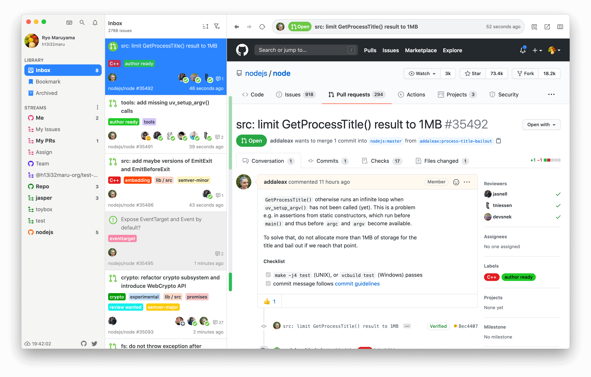
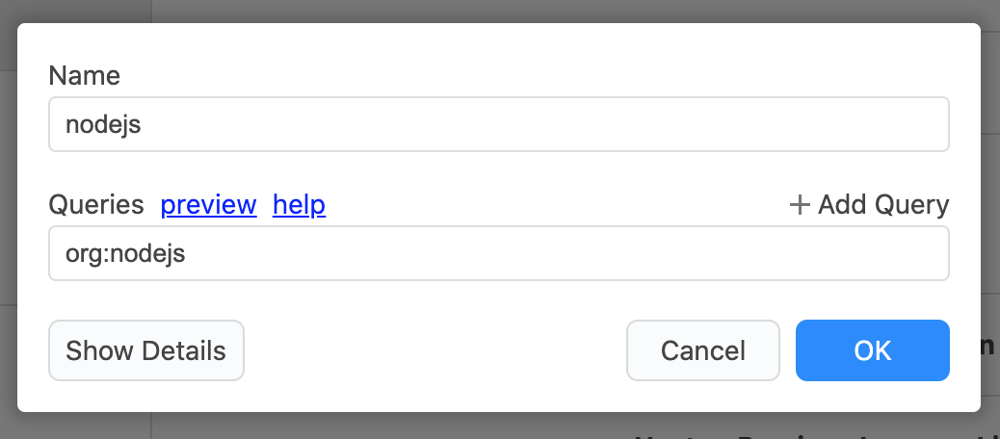

# What is Jasper



[Jasper](https://jasperapp.io/) is a tool that allows you to view GitHub issues and pull requests with flexible criteria. For example, you can browse issues and receive update notifications for issues with conditions such as "pull requests you create" or "issues with a nodejs/node bug label".

We call this functionality **"Stream"** in Jasper, and we can set up a Stream with the following query to view an issue with the conditions described above

```text
author:defunkt is:pr
```

```text
repo:nodejs/node label:bug is:issue
```

## Stream <a id="stream"></a>

Stream is powered by the [GitHub Search API](https://docs.github.com/en/rest/reference/search), which allows you to use very powerful queries. For example, the following query.

| 条件 | クエリ |
| :--- | :--- |
| Issue created by defunkt | [`author:defunkt is:issue`](https://github.com/search?q=author%3Adefunkt+is%3Aissue) |
| pull request in the nodejs/node repository | [`repo:nodejs/node is:pr`](https://github.com/search?q=repo%3Anodejs%2Fnode+is%3Apr) |
| Issue/pull request with a bug label in a nodejs organization | [`org:nodejs label:bug`](https://github.com/search?q=org%3Anodejs+label%3Abug) |

And since Stream can use the exact same queries as the GitHub Search API, you have the flexibility to browse issues you are interested in.




See "[Stream queries](usecase/query.md)" and "[Stream](reference/stream.md)" for a list of queries that can be used with Stream.


## High flexibility <a id="flexible"></a>

Currently, there are several tools for viewing GitHub issues, which fall into three main categories

1. Tools to manage issue viewing and notifications [GitHub Notifications](https://github.com/notifications), [DevHub](https://devhubapp.com/), [Trailer](http://ptsochantaris.github.io/trailer/) and more
2. Tools for Team Collaboration [GitHub Scheduled reminders](https://docs.github.com/en/github/setting-up-and-managing-organizations-and-teams/managing-scheduled-reminders-for-your-team), [Pull Panda](https://pullpanda.com/) and more
3. Tools for project management [GitHub Projects](https://docs.github.com/en/github/managing-your-work-on-github/managing-project-boards), [Zen Hub](https://www.zenhub.com/) and more

Jasper is a tool that belongs to category 1. Normally, tools in this category use the [GitHub Notification API](https://docs.github.com/en/rest/reference/activity#notifications). However, Jasper is built using the [GitHub Search API](https://docs.github.com/en/rest/reference/search), which gives it a lot of flexibility not found in other tools. On the other hand, it may not be as easy to use as other tools. That's why Jasper has been developed with a balance between flexibility and simplicity in mind.


See "[Concept](faq.md#concept)" for more information.


