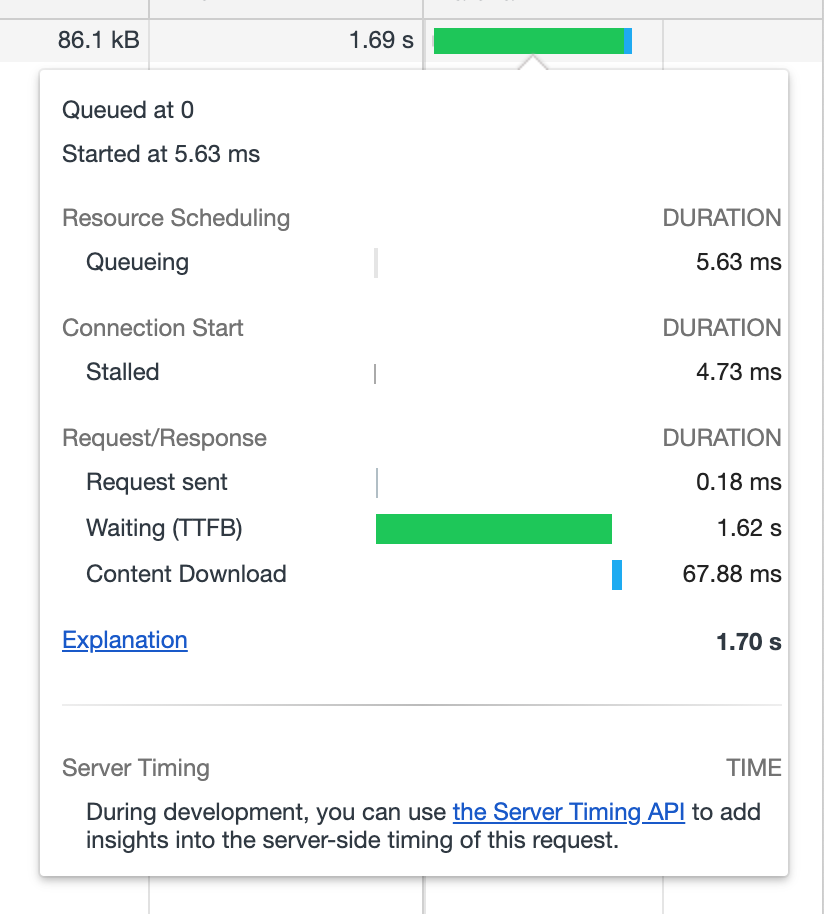

# FAQ

## コンセプト 

Jasperは「簡単さ」よりも「柔軟性」を重視し、様々なユースケースに合わせた使い方ができることを目指しています。そして、「柔軟ではあるが複雑」なツールにならないようにコア機能\(Stream\)から外れた機能はなるべく作らないようにしています。

これにより、類似のツールにはない強みを実現しています。しかし、「柔軟性」を重視したことにより、次の点においては類似のツールに劣る場合があります。

* 使いこなすためのハードル
  * GitHub検索への理解を必要とする
  * たまに使うにはオーバースペック
* ユーザ設定のメンテナンス
  * 状況に合わせた設定をユーザがメンテナンスしていく必要がある
* GHE利用時のサーバ側への負荷
  * GitHub Search APIをヘビーに使用している

そのため、柔軟性とこれらの欠点のバランスを考えながらJasperを開発しています。

## スマートフォンアプリ 

JasperはMac/Window/Linuxに対応していますが、Android/iOSのスマートフォンアプリには対応していません。しかし、GitHub NotificationsとJasperを連携させることで、スマートフォンのブラウザから閲覧したissueをJasperでも既読にすることができます。詳しくは「[スマートフォンと連携](usecase/advanced.md#mobile)」を参照してください。

## 複数マシンの同期 

Jasperは複数マシンでのissue同期には対応していません。Dropboxなどのファイル同期サービスを使って独自に実現しているユーザはいますが、現在は公式サポートしておりません。もしご利用になりたい場合は`メニュー → Dev → Open Data Directory`から開くディレクトリを同期してお試しください。

## タブブラウザ 

Jasperの組み込みブラウザはタブブラウザには非対応です。複数のissueを同時に閲覧する場合は外部ブラウザをご利用ください。

## issueの表示速度 

Jasperの内部ブラウザでissueを表示したときに、表示速度が遅い場合があります。しかしこれはGitHub側のTTFB\(time to first byte\)が遅いためです。Jasper側で改善する目処は今の所たっていません。

## Jasperが表示されなくなった

 Jasperを起動しても真っ白な画面になってしまう場合、データが破損した可能性があります。次の手順でJasperのデータを削除して初期化ください。

1. `メニュー → Dev → Open Data Directory`を選択してディレクトリを表示
2. Jasperを終了
3. 先程のディレクトリ内にある`config.json`, `main.db`を削除
4. Jasperを起動して再セットアップ

この操作を行うと作成済みのStreamやJasper内に保持していたissueは削除されますが、GitHub側のデータには一切影響ありません。

## GitHub Search APIのポーリング 

Jasperのコア機能であるStreamは[GitHub Search API](https://docs.github.com/en/rest/reference/search)を定期的にポーリングすることで実現しています。ポーリングは短い間隔にするとGitHub側に負荷がかかり、長い間隔にするとユーザ側の使い勝手\(issueの更新\)が悪くなります。そこで、Jasperでは以下のようなポーリング設計とすることで、両者のバランスをとっています。

* Streamごとにポーリングするのではなく、Jasper全体で1つのポーリングとする
  * このため、Streamが増えすぎると1つのStreamあたりの更新間隔が伸びる。 この問題を緩和するには「[更新間隔を最適化する](usecase/advanced.md#polling)」を参照してください。
* GitHub APIのrate limitに達した場合、ポーリング間隔を自動的に伸ばす
  * GitHub Search APIのrate limitは60秒間に10リクエストです。デフォルトのポーリング間隔では60秒間に6リクエストであるため、rate limitに達することはありません
  * GHE\(GitHub Enterprise\)ではrate limitが独自に設定されている場合があります。詳しくはGHEの管理者にお問い合わせください。

## サポーター  サブスクリプション 

開発者\([@h13i32maru](https://twitter.com/h13i32maru)\)を支援してくださる方は「[Support Subscription](https://h13i32maru.jp/supporter/)」から少額サブスクリプションをしていただけると大変うれしいです。

## フィードバック 

フィードバックはお気軽にお寄せください。Twitterの[\#jasperapp](https://twitter.com/hashtag/jasperapp)やJasperについてのブログ記事などを書いてもらえると非常に嬉しいです。不具合や機能要望は[jasperapp/jasper](https://github.com/jasperapp/jasper)にお願いします。可能な範囲で対応していきます。

## 競合 

Jasperと同様にissueの閲覧や通知を管理するツールは現時点\(2020.09\)で次のようなものがあります。

| ツール | Active | 期間 |
| :--- | :--- | :--- |
| [Jasper](https://jasperapp.io/)  | ✅ | 2016.06 ~ 2020.07 |
| [Trailer](http://ptsochantaris.github.io/trailer/) | ✅ | 2013.08 ~ 2020.09 |
| [DevHub](https://devhubapp.com/)  | ✅ | 2017.05 ~ 2020.08 |
| [Octobox](https://octobox.io/) | ✅ | 2016.12 ~ 2020.09 |
| [GitHawk](http://githawk.com/) | ✅ | 2017.06 ~ 2020.05 |
| [Deck](https://tilfin.github.io/deck/) |  | 2016.03 ~ 2019.12 |
| [faao](https://github.com/azu/faao) |  | 2017.05 ~ 2019.12 |
| [Cashew](https://github.com/bellebethcooper/cashew) |  | 2017.11 ~ 2019.04 |
| [Bee](http://www.neat.io/bee/github-issues-client.html) |  |  2013.08 ~ 2018.09 |
| [Gitscout](https://gitscout.com/) |  | 2015.11 ~ 2017.05 |
| [Ship](https://www.realartists.com/blog/ship-20.html) |  | 2016.01 ~ 2017.01 |
| [DeckHub](https://getdeckhub.com/) |  | 2016.02 ~ 2016.04 |
| [BugHub](http://www.bughubapp.com/) |  | 2013.04 ~ 2015.11 |

## 記事

開発者の記事

* [JasperというGitHub Issue Readerを作りました -  blog.h13i32maru.jp](http://blog.h13i32maru.jp/entry/2016/06/08/090000)
* [GitHub用のIssue Reader「Jasper」の開発を振り返ってみる - blog.h13i32maru.jp](http://blog.h13i32maru.jp/entry/2016/12/11/184433)
* [Jasper\(GitHub用のIssue Reader\)を無料にしました - blog.h13i32maru.jp](https://blog.h13i32maru.jp/entry/2018/07/17/083215)
* [ストレスフリーなGitHubのIssue生活 - techlife.cookpad.com](http://techlife.cookpad.com/entry/2017/03/14/100000)
* [Project of the Week: Jasper - electronjs.o](https://www.electronjs.org/blog/jasper)

ユーザの記事

* [GithubのISSUEでなにやらやるなら、Jasperが便利だぞ！の話 - uzulla.hateblo.jp](http://uzulla.hateblo.jp/entry/2016/07/13/021425)
* [GitHub Issue Reader の Jasper を1週間使っての所感 - ohbarye.hatenablog.jp](http://ohbarye.hatenablog.jp/entry/2016/11/19/004719)
* [Check my favorite OSS with Jasper - blog.lorentzca.me](https://blog.lorentzca.me/check-my-favorite-oss-with-jasper/)
* [最近使い始めてよかった３つのMacアプリ - medium.com](https://medium.com/@y_koh/%E6%9C%80%E8%BF%91%E4%BD%BF%E3%81%84%E5%A7%8B%E3%82%81%E3%81%A6%E3%82%88%E3%81%8B%E3%81%A3%E3%81%9F%EF%BC%93%E3%81%A4%E3%81%AEmac%E3%82%A2%E3%83%97%E3%83%AA-2e39bc77c925#.j1hugdgm7)
* [Github Issueを管理するJasperを買った - kechol.hatenablog.jp](http://kechol.hatenablog.jp/entry/jasper-a-github-issue-tracker)
* [GitHub Issue Reader「Jasper」をデザイナーにもオススメしたい - transitkix.hatenablog.jp](http://transitkix.hatenablog.jp/entry/2017/08/10/231124)
* [jasperがよかった - medium.com](https://medium.com/@naomeme/jasper%E3%81%8C%E3%82%88%E3%81%8B%E3%81%A3%E3%81%9F-fb70ebd117c0)
* [Jasper。プロダクトマネージャーがボトルネックとならないための最高のツール - quipper.hatenablog.com](https://quipper.hatenablog.com/entry/2018/06/28/120000)

