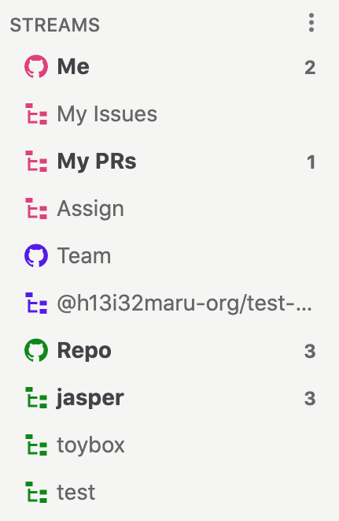
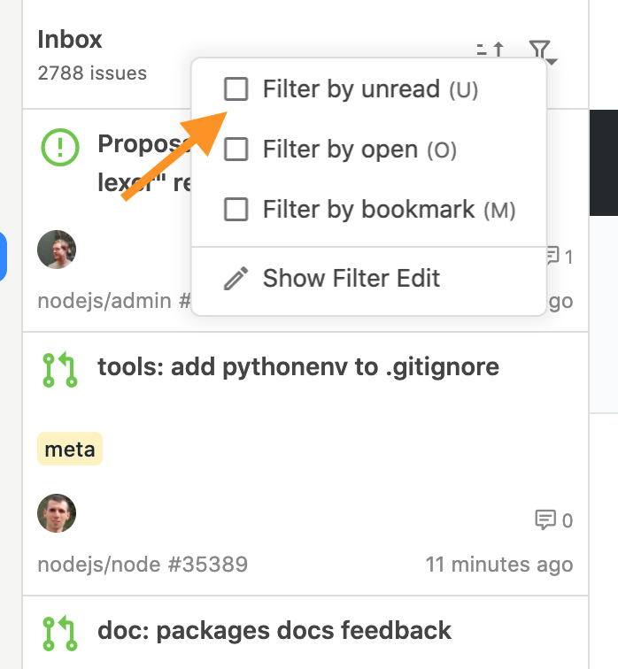
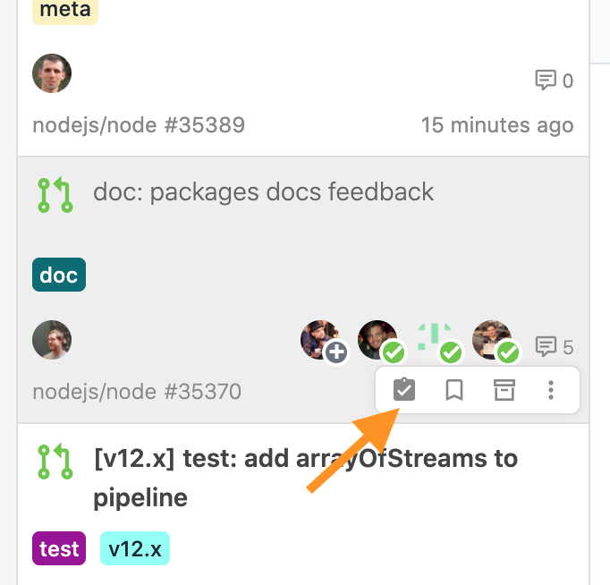

# 基本的な使い方

## Stream

セットアップ後に自動的に次のようなStreamが作成されます。

<table>
  <thead>
    <tr>
      <th style="text-align:left">Stream</th>
      <th style="text-align:left">&#x8AAC;&#x660E;</th>
    </tr>
  </thead>
  <tbody>
    <tr>
      <td style="text-align:left"><code>Me</code>
      </td>
      <td style="text-align:left">
        
&#x81EA;&#x5206;&#x306B;&#x95A2;&#x4FC2;&#x3059;&#x308B;issue/pull request&#x3092;&#x898B;&#x308B;&#x3053;&#x3068;&#x304C;&#x3067;&#x304D;&#x307E;&#x3059;&#x3002;&#x57FA;&#x672C;&#x7684;&#x306B;&#x306F;&#x3053;&#x306E;Stream&#x3092;&#x898B;&#x308C;&#x3070;&#x898B;&#x843D;&#x3068;&#x3057;&#x306F;&#x3042;&#x308A;&#x307E;&#x305B;&#x3093;&#x3002;

        
<code>My Issues</code>&#x3001;<code>My PRs</code>&#x3001;<code>Assign</code>&#x3067;&#x30D5;&#x30A3;&#x30EB;&#x30BF;&#x30FC;&#x3055;&#x308C;&#x305F;issue&#x3092;&#x898B;&#x308B;&#x3053;&#x3068;&#x3082;&#x3067;&#x304D;&#x307E;&#x3059;&#x3002;

      </td>
    </tr>
    <tr>
      <td style="text-align:left"><code>Team</code>
      </td>
      <td style="text-align:left">
        
&#x6240;&#x5C5E;&#x3057;&#x3066;&#x3044;&#x308B;&#x30C1;&#x30FC;&#x30E0;&#x306B;&#x30E1;&#x30F3;&#x30B7;&#x30E7;&#x30F3;&#x3055;&#x308C;&#x305F;issue&#x3067;&#x3059;&#x3002;

        
&#x30C1;&#x30FC;&#x30E0;&#x3054;&#x3068;&#x306B;&#x30D5;&#x30A3;&#x30EB;&#x30BF;&#x30FC;&#x3055;&#x308C;&#x305F;issue&#x3092;&#x898B;&#x308B;&#x3053;&#x3068;&#x3082;&#x3067;&#x304D;&#x307E;&#x3059;&#x3002;

      </td>
    </tr>
    <tr>
      <td style="text-align:left"><code>Repo</code>
      </td>
      <td style="text-align:left">
        
&#x6700;&#x8FD1;&#x6D3B;&#x52D5;&#x3057;&#x305F;&#x30EA;&#x30DD;&#x30B8;&#x30C8;&#x30EA;&#x306E;issue&#x3067;&#x3059;&#x3002;

        
&#x30EA;&#x30DD;&#x30B8;&#x30C8;&#x30EA;&#x3054;&#x3068;&#x306B;&#x30D5;&#x30A3;&#x30EB;&#x30BF;&#x30FC;&#x3055;&#x308C;&#x305F;issue&#x3092;&#x898B;&#x308B;&#x3053;&#x3068;&#x3082;&#x3067;&#x304D;&#x307E;&#x3059;&#x3002;

      </td>
    </tr>
  </tbody>
</table>

## issue 

次の操作はissueの閲覧に特に役立ちます。

<table>
  <thead>
    <tr>
      <th style="text-align:left">&#x52D5;&#x4F5C;</th>
      <th style="text-align:left">&#x64CD;&#x4F5C;&#x65B9;&#x6CD5;</th>
    </tr>
  </thead>
  <tbody>
    <tr>
      <td style="text-align:left">&#x672A;&#x8AAD;issue&#x3060;&#x3051;&#x3092;&#x8868;&#x793A;&#x3059;&#x308B;</td>
      <td
      style="text-align:left">
        
&#x30D5;&#x30A3;&#x30EB;&#x30BF;&#x30FC;&#x30E1;&#x30CB;&#x30E5;&#x30FC;&#x306E;<code>Filter by unread</code>&#x3092;&#x9078;&#x629E;&#x3059;&#x308B;&#x3002;

        
&#x3082;&#x3057;&#x304F;&#x306F;&#x30AD;&#x30FC;&#x30DC;&#x30FC;&#x30C9;&#x306E;<code> U </code>&#x3092;&#x62BC;&#x3059;&#x3002;

        </td>
    </tr>
    <tr>
      <td style="text-align:left">issue&#x3092;&#x672A;&#x8AAD;&#x306B;&#x623B;&#x3059;</td>
      <td style="text-align:left">
        
&#x30D5;&#x30ED;&#x30FC;&#x30C6;&#x30A3;&#x30F3;&#x30B0;&#x30E1;&#x30CB;&#x30E5;&#x30FC;&#x306E;&#x672A;&#x8AAD;&#x30A2;&#x30A4;&#x30B3;&#x30F3;&#x3092;&#x30AF;&#x30EA;&#x30C3;&#x30AF;&#x3059;&#x308B;&#x3002;

        
&#x3082;&#x3057;&#x304F;&#x306F;&#x30AD;&#x30FC;&#x30DC;&#x30FC;&#x30C9;&#x306E;<code> I </code>&#x3092;&#x62BC;&#x3059;&#x3002;

      </td>
    </tr>
  </tbody>
</table>











## ブラウザ 

前回閲覧時から追加、更新されたコメントはハイライトされて表示されます。


さらに詳しい使い方は「[ユースケースごとの使い方](../usecase/)」「[リファレンス](../reference/)」を参照してください。


