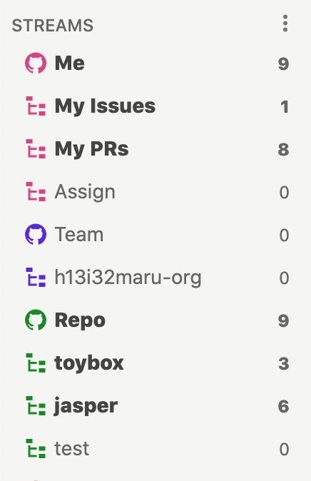
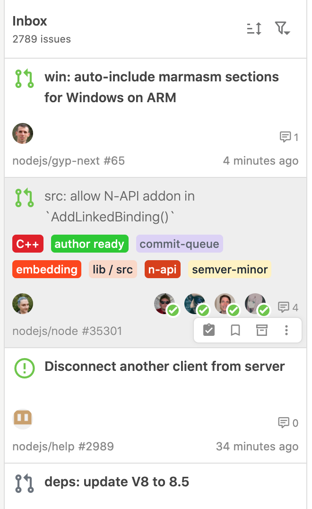
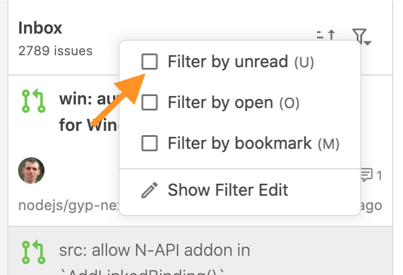
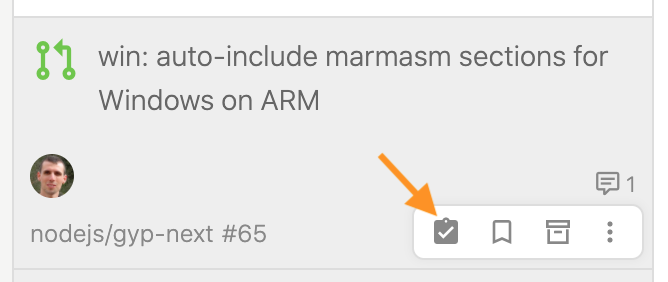
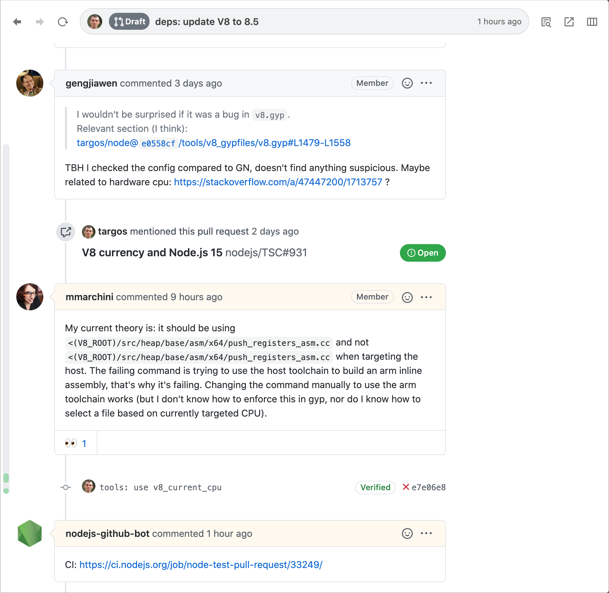

# Basic usage

## Stream

After setup, it will automatically create Streams.

| Stream | description |
| :--- | :--- |
| `Me` | You can see the issues/pull requests that are relevant to you. Basically, you can look at this stream and you won't miss anything.  You will also see the Streams filtered by "My Issues", "My PRs" and "Assign". |
| `Team` | Issues that are maintained by the team you are on. You will also see a Stream filtered by team \(Organization\). |
| `Repo` | Issues from the repositories you have recently been active in. You can also see a filtered Stream for each repository. |

## issues

The following operations are particularly useful for viewing issues

| action | How to operate |
| :--- | :--- |
| Show only unread issues | Select `Filter by unread` in the filter menu. Or press  `U`  on the keyboard. |
| Set the issue back to unread | Click the unread icon on the floating menu. Or press  `I`  on the keyboard. |











## Browser

Comments that have been added or updated since the last time you viewed the site will be highlighted.


For more information on how to use it, please refer to "[Use cases](../usecase/)" and "[Reference](../reference/)".


