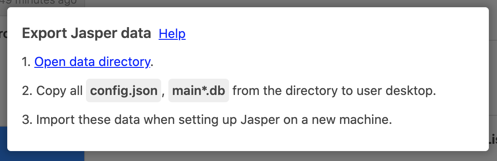
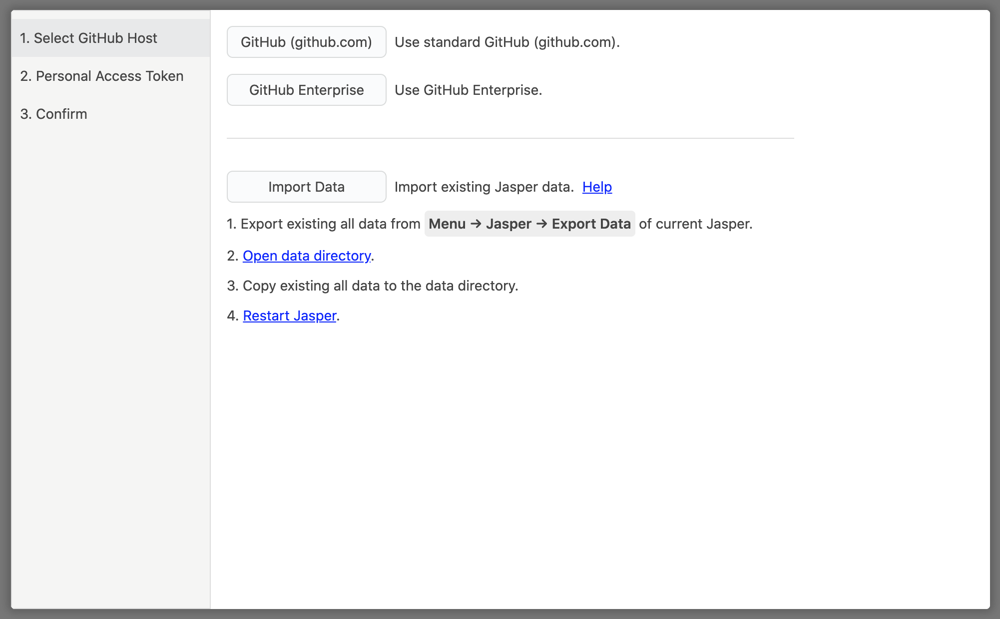

# Data migration

## 1. Save existing data 

Start Jasper on the old machine and select `Menu → Jasper → Export Data`.

Click `Open data directory` to display the directory. Copy the `config.json` and `main.db` in the directory displayed to your desktop. Move these data to your new machine using Google Drive or Dropbox etc.


If you have multiple accounts registered in Jasper, you will also need to copy a file such as `main-123456789.db`.


## 2. Migrate data to the new machine 

Start Jasper on a new machine. On the first configuration screen, select `Import Data`.

Click on the `Open data directory` to display the directory. Copy \(overwrite\) the `config.json` and `main.db` that you just moved into this directory. Finally, click on `Restart Jasper` and your data migration is complete.

