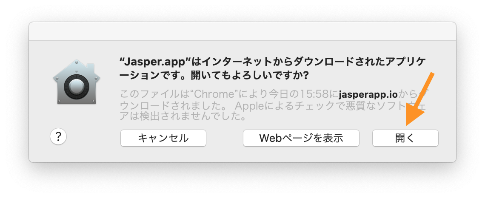
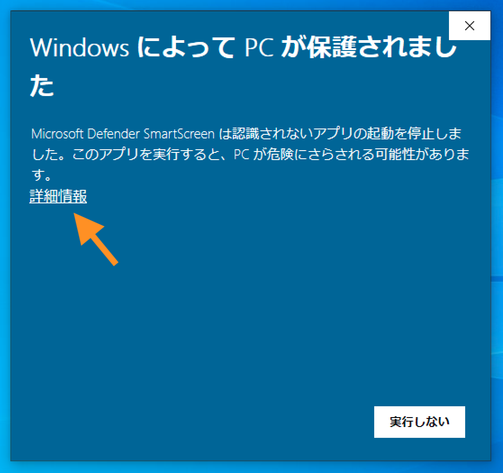
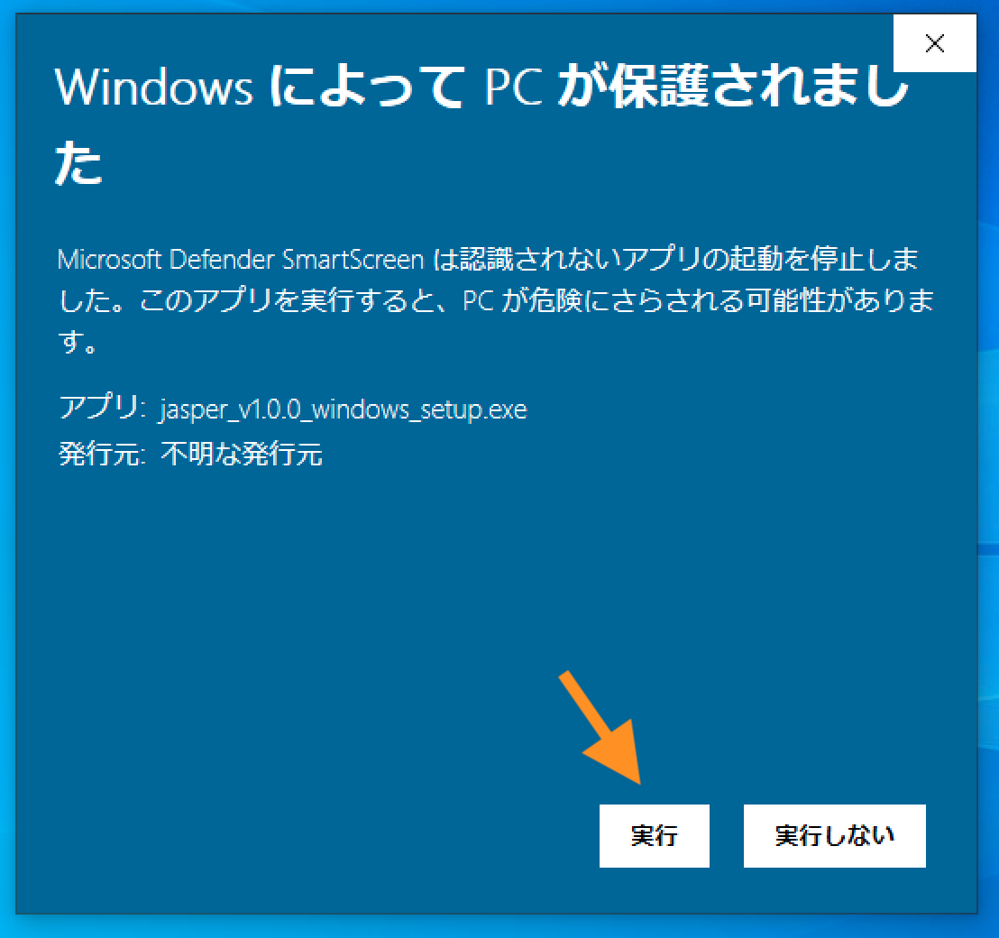
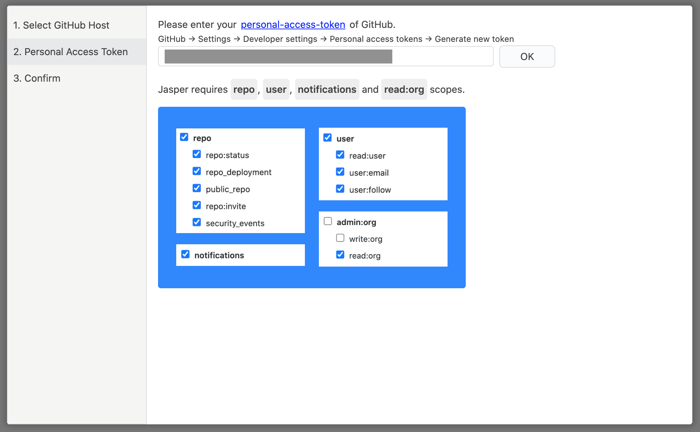
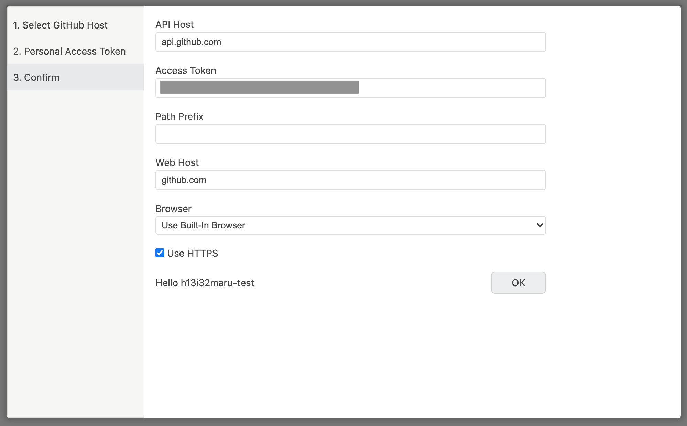

# Setup

## インストール 

[jasperapp.io](https://jasperapp.io/) から最新のJasperをダウンロードし、zipファイルを展開してください。Jasperを起動すると、Mac/Windowsでは以下の確認が表示されます。説明に従い起動を完了してください。











## GitHubの設定 

Jasperを起動するとGitHub, GHE\(GitHub Enterprise\)の選択が表示されます。GHEの場合はホスト名`例 ghe.example.com`を入力してください。

つぎにアクセストークンの入力が必要になります。GitHubの場合は[Personal access token](https://github.com/settings/tokens)の画面から作成できます。GHEの場合は管理者にお問い合わせください。必要なスコープは`repo`, `read:org`, `notifications`, `user`です。 

最後に設定内容を確認してOKを押してください。ユーザ名が表示されれば完了です🎉

## 初回読み込み 

設定が完了すると、自動的にissueの読み込みが開始されます。この初回の読み込みには数分ほどかかります。Jasperを終了せず、お使いください。

初回読み込み中に「[基本的な使い方](basic-usage.md)」をお読みいただくことで、Jasperをスムーズに使い始めることができます。

