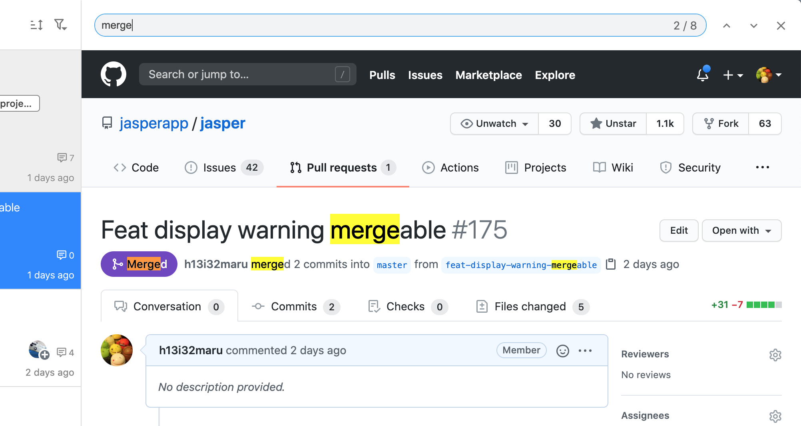

# ブラウザ

## ページ内検索 

ページ内の検索を行うにはページ右上の虫眼鏡アイコンを押してください。もしくはキーボードの`⌘ + F(Mac)`, `Ctrl + F(Window/Linux)`を押すことで検索することもできます。

## 外部ブラウザで開く 

現在のページを外部ブラウザで開くにはページ右上の開くアイコンを押してください。もしくはキーボードの`⌘ + O(Mac)`, `Ctrl + O(Windows)`を押すことでも開くことができます。

## URLを表示 

現在のページのURLを表示するにはページ上部のissue情報エリアをクリックしてください。もしくはキーボードの`⌘ + L(Mac)`, `Ctrl + L(Window/Linux)`を押すことでも表示することができます。

## issue本文の差分表示 

issueを前回閲覧した時からissue本文に更新があれば、その差分を表示します。











## 未読コメントのハイライト・ミニマップ 

issueを前回閲覧した時からコメントの追加・更新があれば、そのコメントをハイライト表示します。また、それらのハイライトされたコメントをミニマップ上に表示します。











