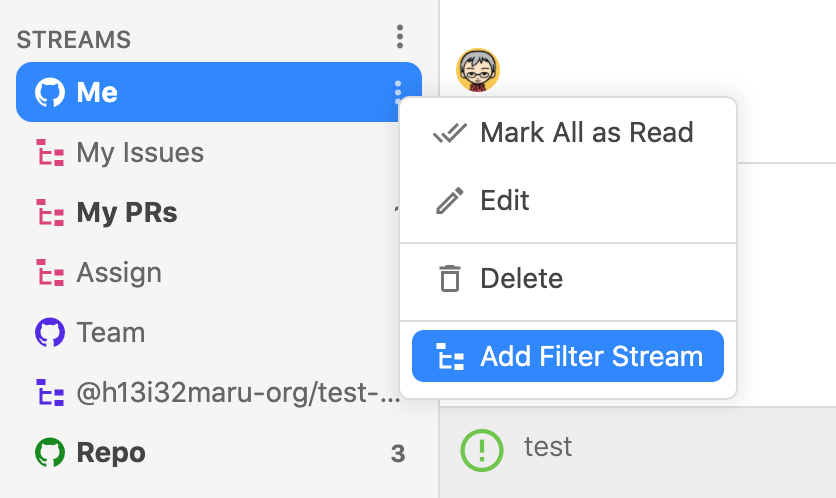
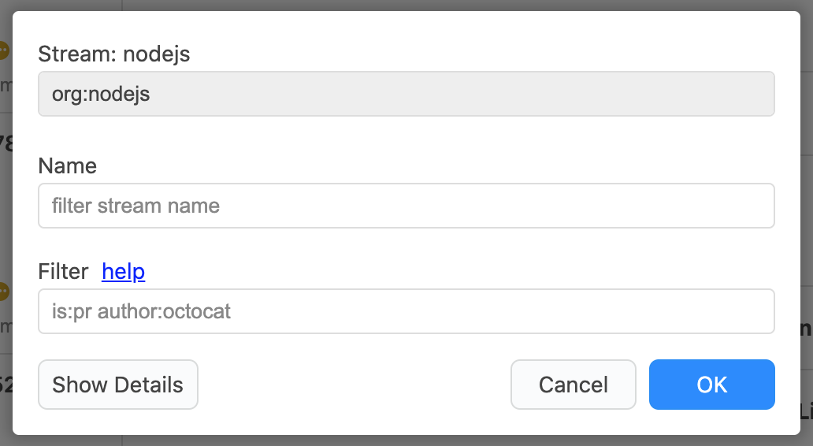
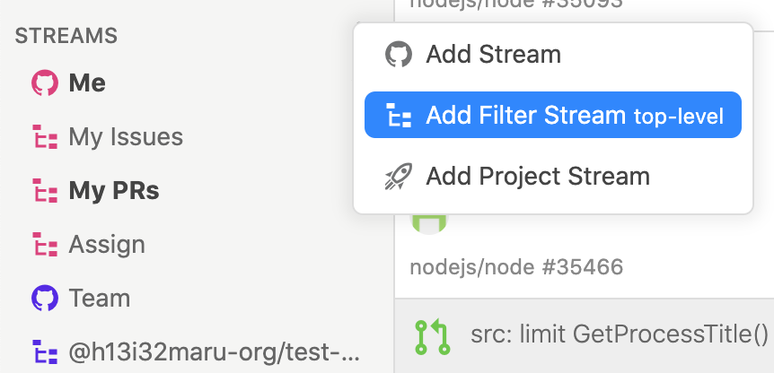
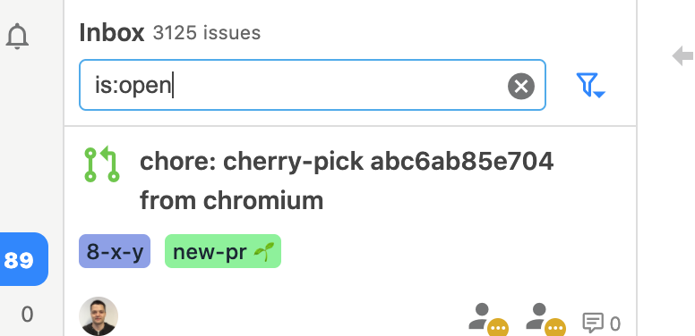

# Filter Stream

Filter StreamはStreamのissueをフィルターして表示します。

Filter StreamはStreamのメニューにある`Add Filter Stream`から追加します。もしくはトップレベルに作成する場合は`Add Filter Stream top-level`から追加します。また、一時的にFilterを適用することもできます。




















Filter Streamで使用できるフィルターはStreamとほとんど同じ条件を指定できます。ただし、少し異なるものもあるので注意してください。


## issueの状態 

<table>
  <thead>
    <tr>
      <th style="text-align:left">&#x30D5;&#x30A3;&#x30EB;&#x30BF;&#x30FC;</th>
      <th style="text-align:left">&#x8AAC;&#x660E;</th>
    </tr>
  </thead>
  <tbody>
    <tr>
      <td style="text-align:left"><code>is:issue</code>, <code>is:pr</code>
      </td>
      <td style="text-align:left">issue&#x306E;&#x307F;&#x3001;pull request&#x306E;&#x307F;</td>
    </tr>
    <tr>
      <td style="text-align:left"><code>is:open</code>, <code>is:closed</code>
      </td>
      <td style="text-align:left">&#x30AA;&#x30FC;&#x30D7;&#x30F3;&#x3055;&#x308C;&#x3066;&#x3044;&#x308B;issue&#x3001;&#x30AF;&#x30ED;&#x30FC;&#x30BA;&#x3055;&#x308C;&#x3066;&#x3044;&#x308B;issue</td>
    </tr>
    <tr>
      <td style="text-align:left"><code>is:merged</code>, <code>is:unmerged</code>
      </td>
      <td style="text-align:left">&#x30DE;&#x30FC;&#x30B8;&#x3055;&#x308C;&#x3066;&#x3044;&#x308B;issue&#x3001;&#x30DE;&#x30FC;&#x30B8;&#x3055;&#x308C;&#x3066;&#x3044;&#x306A;&#x3044;issue</td>
    </tr>
    <tr>
      <td style="text-align:left"><code>draft:true</code>, <code>draft:false</code>
      </td>
      <td style="text-align:left">&#x30C9;&#x30E9;&#x30D5;&#x30C8;&#x306E;issue&#x3001;&#x30C9;&#x30E9;&#x30D5;&#x30C8;&#x3067;&#x306F;&#x306A;&#x3044;issue&#x200C;</td>
    </tr>
    <tr>
      <td style="text-align:left"><code>is:read</code>, <code>is:unread</code>
      </td>
      <td style="text-align:left">&#x65E2;&#x8AAD;&#x306E;issue&#x3001;&#x672A;&#x8AAD;&#x306E;issue</td>
    </tr>
    <tr>
      <td style="text-align:left"><code>is:bookmark</code>, <code>is:unbookmark</code>
      </td>
      <td style="text-align:left">&#x30D6;&#x30C3;&#x30AF;&#x30DE;&#x30FC;&#x30AF;&#x3055;&#x308C;&#x305F;issue&#x3001;
         &#x30D6;&#x30C3;&#x30AF;&#x30DE;&#x30FC;&#x30AF;&#x3055;&#x308C;&#x3066;&#x3044;&#x306A;&#x3044;issue</td>
    </tr>
    <tr>
      <td style="text-align:left"><code>is:archived</code>, <code>is:unarchived</code>
      </td>
      <td style="text-align:left">
        
&#x30A2;&#x30FC;&#x30AB;&#x30A4;&#x30D6;&#x3055;&#x308C;&#x305F;issue&#x3001;

        
&#x30A2;&#x30FC;&#x30AB;&#x30A4;&#x30D6;&#x3055;&#x308C;&#x3066;&#x3044;&#x306A;&#x3044;issue

      </td>
    </tr>
    <tr>
      <td style="text-align:left"><code>is:private</code>, <code>is:unprivate</code>
      </td>
      <td style="text-align:left">
        
&#x30D7;&#x30E9;&#x30A4;&#x30D9;&#x30FC;&#x30C8;&#x30EA;&#x30DD;&#x30B8;&#x30C8;&#x30EA;&#x306E;issue&#x3001;

        
&#x30D1;&#x30D6;&#x30EA;&#x30C3;&#x30AF;&#x30EA;&#x30DD;&#x30B8;&#x30C8;&#x30EA;&#x306E;issue

      </td>
    </tr>
  </tbody>
</table>

## ユーザやチーム 

| フィルター | 説明 |
| :--- | :--- |
| `involves:defunkt` | ユーザが関係するissue |
| `author:defunkt` | ユーザが作成したissue |
| `assignee:defunkt` | ユーザがアサインされたissue |
| `mentions:defunkt` | ユーザがメンションされたissue |
| `team:github/owners` | チームがメンションされたissue |


同じ種類のフィルターを複数指定するとOR条件になります。例えば、`involves:defunkt involves:jlord`は`defunkt`もしくは`jlord`が関係するissueです。



`involves`は`author`, `assignee`, `mentions`,`commenter`, `review-requested`をまとめて指定したものと同様になります。‌


## Pull requestレビュー 

| フィルター | 説明 |
| :--- | :--- |
| `review-requested:defunkt` | ユーザ/チームがレビューリクエストされたpull request |
| `reviewed-by:defunkt` | ユーザがレビューしたpull request |


同じ種類のクエリを複数指定するとOR条件になります。例えば、‌`review-requested:defunkt review-requested:jlord`は`defunkt`もしくは`jlord`がレビューリクエストされたpull requestです。


## リポジトリやOrganization 

| フィルター | 説明 |
| :--- | :--- |
| `repo:nodejs/node` | リポジトリのissue |
| `org:nodejs` | Organizationのissue |
| `user:defunkt` | ユーザ下のissue |


同じ種類のクエリを複数指定するとOR条件になります。‌例えば、`repo:nodejs/node repo:electron/electron`は`nodejs/node`もしくは`electron/electron`のissueです。


## ラベルやマイルストーンなど 

| フィルター | 説明 |
| :--- | :--- |
| `label:bug` | ラベルがついたissue |
| `milestone:v1.0.0` | マイルストーンがついたissue |
| `project-name:hello-pj` | プロジェクトに紐付いたissue |
| `project-column:now-doing` | プロジェクトカラムに紐付いたissue |
| `number:123` | 特定のissue番号 |


同じ種類のクエリを複数指定するとOR条件になります。例えば、`milestone:v1.0.0 milestone:v2.0.0`は`v1.0.0`もしくは`v2.0.0`のマイルストーンがついたissueです。ただし、ラベルについてはAND条件となります。



スペースを含むラベルやマイルストーンの場合は`label:"`hello `world"`のようにダブルクオーテーションで囲んでください。‌


## 任意のキーワード 

| フィルター | 説明 |
| :--- | :--- |
| `github octocat` | キーワード\(AND条件\)が含まれるissue |


スペースを含む場合は`"hello world"`のようにダブルクオーテーションで囲んでください。



キーワードはissue本文, author, assignee, label, milestone, repository, org, involves, review-requested, review, project-name, project-columnsを対象とします。



OR, NOTには対応していません。


## 除外・欠如 

| フィルター | 説明 |
| :--- | :--- |
| `-label:bug`, `-milestone:v0.0.1`, `-repo:nodejs/node` `-involves:defunk`... | 指定した条件が含まれないissue |
| `no:label`, `no:milestone`, `no:assignee`, `no:project`, `no:dueon` | ラベル、マイルストーン、アサイン、 プロジェクト、締切が設定されていないissue |
| `have:label`, `have:milestone`, `have:assignee`, `have:project`, `have:dueon` | ラベル、マイルストーン、アサイン、 プロジェクト、締切が設定されているissue |

