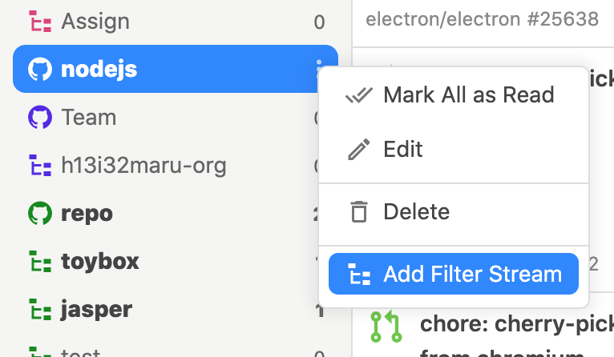
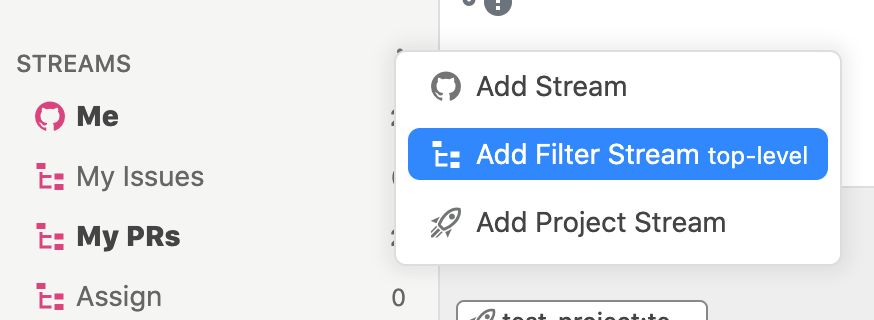

# Filter Stream

Filter Stream filters the Stream's issues and displays them.

Filter Streams are added from the `Add Filter Stream` menu in the Stream menu. Or, to create a top-level stream, add it from the `Add Filter Stream top-level` menu. It is also possible to apply a Filter temporarily.




















The filters available in the Filter Stream are pretty much the same as in the Stream, but note that some of them are slightly different.


## State of issues

| Filter | Condition |
| :--- | :--- |
| `is:issue`, `is:pr` | Issues only, pull requests only |
| `is:open`, `is:closed` | Opened issues, closed issues |
| `is:merged`, `is:unmerged` | Merged issues, unmerged issues |
| `draft:true`, `draft:false` | Draft issues, not draft issue‌s |
| `is:read`, `is:unread` | Read issues, unread issues |
| `is:bookmark`, `is:unbookmark` | Bookmarked issues, not bookmarked issue |
| `is:archived`, `is:unarchived` | Archived issues, not archived issues |
| `is:private`, `is:unprivate` | Private repository issues, not private repository issues |

## Involve users and teams 

| Filter | Condition |
| :--- | :--- |
| `involves:defunkt` | User involved issues |
| `author:defunkt` | User created issues |
| `assignee:defunkt` | User assigned issues |


Multiple filters of the same type can be specified as OR conditions. For example, `involves:defunkt involves:jlord` is an issue involving `defunkt` or `jlord`.



`involves` as well as `author`, `assignee`, `commenter` and `review-requested` all together.‌


## Pull requests review 

| Filter | Condition |
| :--- | :--- |
| `review-requested:defunkt` | Pull requests where the user/team has requested a review |
| `reviewed-by:defunkt` | User reviewed pull requests |


Specifying multiple queries of the same type is an OR condition. For example, `review-requested:defunkt review-requested:jlord` is pull requests where `defunkt` or `jlord` is the review request.


## Repository and Organization 

| Filter | Condition |
| :--- | :--- |
| `repo:nodejs/node repo:electron/electron` | リポジトリのissue |
| `org:nodejs org:electron` | Organizationのissue |
| `user:defunkt user:jlord` | ユーザ下のissue |


同じ種類のクエリを複数指定するとOR条件になります。‌例えば、`repo:nodejs/node repo:electron/electron`は`nodejs/node`もしくは`electron/electron`のissueです。


## ラベルやマイルストーンなど 

| フィルター | 条件 |
| :--- | :--- |
| `label:bug label:important` | ラベルがついたissue |
| `milestone:v1.0.0 milestone:v2.0.0` | マイルストーンがついたissue |
| `project-name:hello-pj` | プロジェクトに紐付いたissue |
| `project-column:now-doing` | プロジェクトカラムに紐付いたissue |
| `number:123` | 特定のissue番号 |


同じ種類のクエリを複数指定するとOR条件になります。例えば、`milestone:v1.0.0 milestone:v2.0.0`は`v1.0.0`もしくは`v2.0.0`のマイルストーンがついたissueです。ただし、ラベルについてはAND条件となります。



スペースを含むラベルやマイルストーンの場合は`label:"`hello `world"`のようにダブルクオーテーションで囲んでください。‌


## 任意のキーワード 

| フィルター | 条件 |
| :--- | :--- |
| `github octocat` | キーワード\(AND条件\)が含まれるissue |


スペースを含む場合は`"hello world"`のようにダブルクオーテーションで囲んでください。



キーワードはissue本文, author, assignee, label, milestone, repository, org, involves, review-requested, review, project-name, project-columnsを対象とします。



OR, NOTには対応していません。


## 除外・欠如 

| フィルター | 条件 |
| :--- | :--- |
| `-label:bug`, `-milestone:v0.0.1`, `-repo:nodejs/node` `-involves:defunk`... | 指定した条件が含まれないissue |
| `no:label`, `no:milestone`, `no:assignee`, `no:project`, `no:dueon` | ラベル、マイルストーン、アサイン、 プロジェクト、締切が設定されていないissue |
| `have:label`, `have:milestone`, `have:assignee`, `have:project`, `have:dueon` | ラベル、マイルストーン、アサイン、 プロジェクト、締切が設定されているissue |

