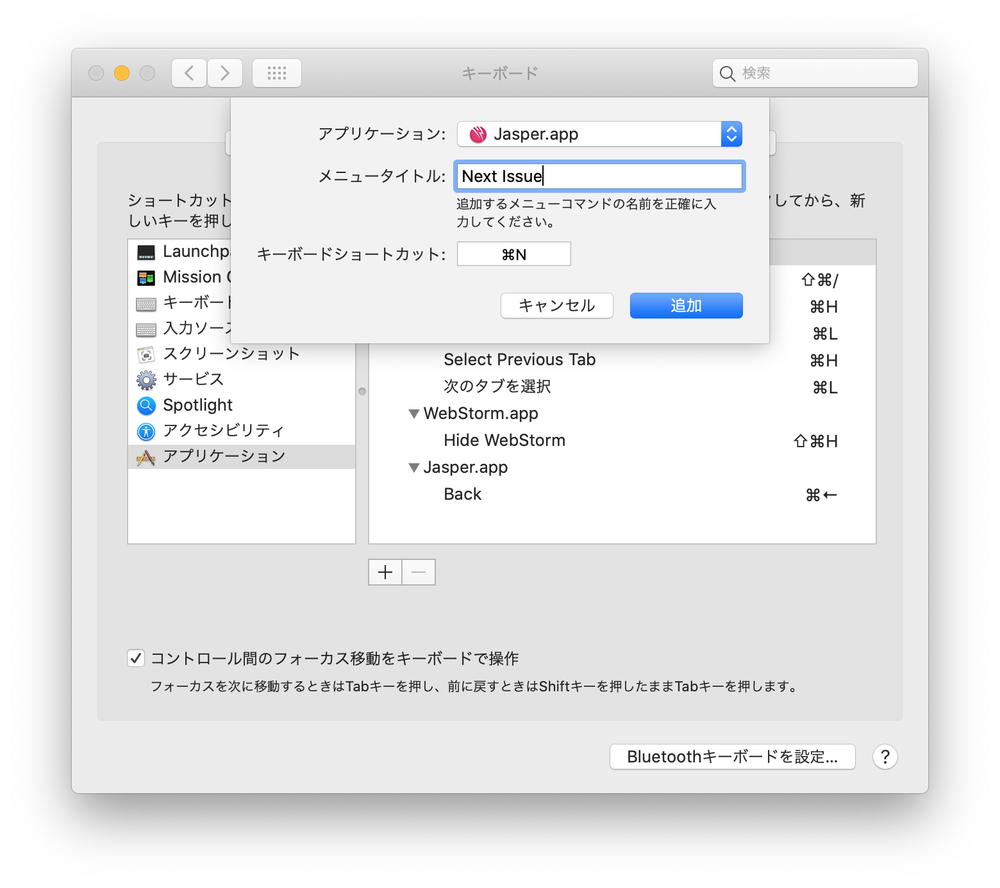

# キーボードショートカット

## Viewのキーボードショートカット 

<table>
  <thead>
    <tr>
      <th style="text-align:left">&#x52D5;&#x4F5C;</th>
      <th style="text-align:left">&#x30AD;&#x30FC;&#x30DC;&#x30FC;&#x30C9;&#x30B7;&#x30E7;&#x30FC;&#x30C8;&#x30AB;&#x30C3;&#x30C8;</th>
    </tr>
  </thead>
  <tbody>
    <tr>
      <td style="text-align:left">Jump Navigation&#x306E;&#x8868;&#x793A;</td>
      <td style="text-align:left"><code>&#x2318; + K</code>, <code>Ctrl + K</code>
      </td>
    </tr>
    <tr>
      <td style="text-align:left">&#x6700;&#x8FD1;&#x95B2;&#x89A7;&#x3057;&#x305F;issue&#x3092;&#x8868;&#x793A;</td>
      <td
      style="text-align:left"><code>&#x2318; + E</code>, <code>Ctrl + E</code>
        </td>
    </tr>
    <tr>
      <td style="text-align:left">&#x30EC;&#x30A4;&#x30A2;&#x30A6;&#x30C8;&#x3092;&#x5909;&#x66F4;</td>
      <td
      style="text-align:left">
        
<code>&#x2318; + 1</code>, <code>&#x2318;  + 2</code>, <code>&#x2318; + 3</code>
        

        
<code>Ctrl + 1</code>, <code>Ctrl + 2</code>, <code>Ctrl + 3</code>
        

        </td>
    </tr>
  </tbody>
</table>

## Streamのキーボードショートカット 

| 動作 | キーボードショートカット |
| :--- | :--- |
| 通知のオン/オフ | ⌘ + I, Ctrl + I |
| 次/前のStreamに移動 |  `D` ,  `F`  |
| n番目のStreamに移動 |  `1` ,  `2` ,  `3` ,  `4` ,  `5`  |

## issueのキーボードショートカット 

| 動作 | キーボードショートカット |
| :--- | :--- |
| issueリストをリロード |  `.`  |
| 次/前のissueに移動 |  `J` ,  `K`  |
| 次/前の未読issueに移動 | `Shift + J`, `Shift + K` |
| 未読/既読を切り替え |  `I`  |
| ブックマークへの追加/削除 |  `B`  |
| アーカイブへの移動/復帰 |  `E`  |
| 自身が作者のissueのみ表示 |  `A`  |
| 自身がアサインされているissueのみ表示 |  `N`  |
| 未読のissueのみ表示 |  `U`  |
| オープン状態のissueのみ表示 |  `O`  |
| ブックマークしているissueのみ表示 |  `M`  |

## ブラウザのキーボードショートカット 

<table>
  <thead>
    <tr>
      <th style="text-align:left">&#x52D5;&#x4F5C;</th>
      <th style="text-align:left">&#x30AD;&#x30FC;&#x30DC;&#x30FC;&#x30C9;&#x30B7;&#x30E7;&#x30FC;&#x30C8;&#x30AB;&#x30C3;&#x30C8;</th>
    </tr>
  </thead>
  <tbody>
    <tr>
      <td style="text-align:left">&#x30DA;&#x30FC;&#x30B8;&#x3092;&#x518D;&#x8AAD;&#x307F;&#x8FBC;&#x307F;</td>
      <td
      style="text-align:left"><code>&#x2318; + R</code>, <code>Ctrl + R</code>
        </td>
    </tr>
    <tr>
      <td style="text-align:left">&#x30DA;&#x30FC;&#x30B8;&#x3092;&#x524D;&#x306B;&#x623B;&#x308B;</td>
      <td
      style="text-align:left"><code>&#x2318; + [</code>, <code>Ctrl + [</code>
        </td>
    </tr>
    <tr>
      <td style="text-align:left">&#x30DA;&#x30FC;&#x30B8;&#x3092;&#x6B21;&#x306B;&#x9032;&#x3080;</td>
      <td
      style="text-align:left"><code>&#x2318; + ]</code>, <code>Ctrl + [</code>
        </td>
    </tr>
    <tr>
      <td style="text-align:left">&#x30DA;&#x30FC;&#x30B8;&#x3092;&#x4E0B;/&#x4E0A;&#x306B;&#x30B9;&#x30AF;&#x30ED;&#x30FC;&#x30EB;</td>
      <td
      style="text-align:left"><code>Space</code>, <code>Shift + Space</code>
        </td>
    </tr>
    <tr>
      <td style="text-align:left">&#x30DA;&#x30FC;&#x30B8;&#x3092;&#x5927;&#x304D;&#x304F;&#x4E0B;/&#x4E0A;&#x306B;&#x30B9;&#x30AF;&#x30ED;&#x30FC;&#x30EB;</td>
      <td
      style="text-align:left">
        
<code>Option + J</code>, <code>Option + K</code>
        

        
<code>Alt + J</code>, <code>Alt + K</code>
        

        </td>
    </tr>
    <tr>
      <td style="text-align:left">&#x30DA;&#x30FC;&#x30B8;&#x5185;&#x3092;&#x691C;&#x7D22;</td>
      <td style="text-align:left"><code>&#x2318; + F</code>, <code>Ctrl + F</code>
      </td>
    </tr>
    <tr>
      <td style="text-align:left">URL&#x30D0;&#x30FC;&#x3092;&#x958B;&#x304F;</td>
      <td style="text-align:left"><code>&#x2318; + L</code>, <code>Ctrl + L</code>
      </td>
    </tr>
    <tr>
      <td style="text-align:left">&#x30DA;&#x30FC;&#x30B8;&#x3092;&#x5916;&#x90E8;&#x30D6;&#x30E9;&#x30A6;&#x30B6;&#x3067;&#x958B;&#x304F;</td>
      <td
      style="text-align:left"><code>&#x2318; + O</code>, <code>Ctrl + O</code>
        </td>
    </tr>
  </tbody>
</table>

## キーボードショートカットをカスタマイズする\(Mac\) 


ここではMacでのキーボードショートカット
のカスタマイズ方法を紹介します。Window/Linuxについては対象外です。


キーボードショートカットを任意のキーに変更するには次のように行います

* Macの設定から「`キーボード` → `ショートカット` → `アプリケーション`」を表示
*   `+` ボタンかららショートカットキーを追加します
  * アプリケーション: `Jasper.app`
  * メニュータイトル: キーを変更したいメニュー名\(例 `Next Issue`\)
  * キーボードショートカット: 設定したいキー

