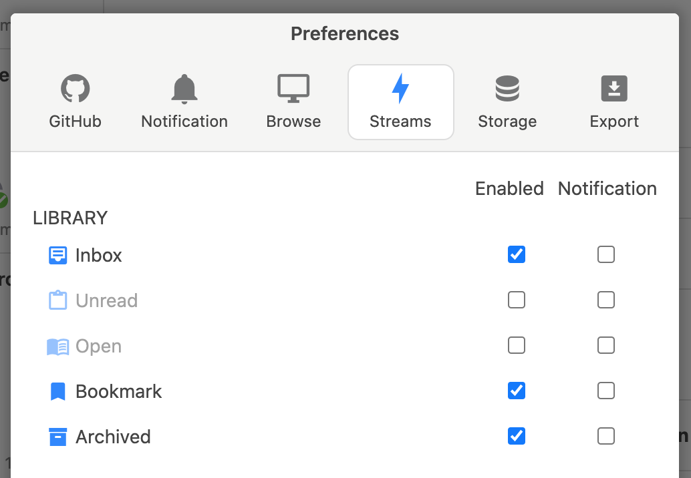
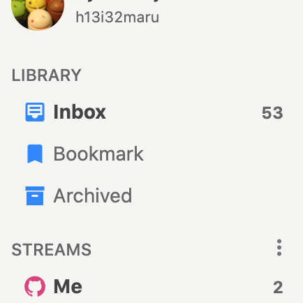

# Library Stream

The Library Stream is a cross-section of issues within Jasper. To use the Library Stream, go to the `Menu → Preferences → Streams` and enable it.

| Library Stream | description |
| :--- | :--- |
| `Inbox` | All issues that are not archived |
| `Open` | Open issues that are not archived |
| `Unread` | Unread issues that are not archived |
| `Bookmark` | Bookmarked issues that are not archived |
| `Archived` | Archived issues |

`Inbox`, `Bookmark`, and `Archived` are enabled by default.

