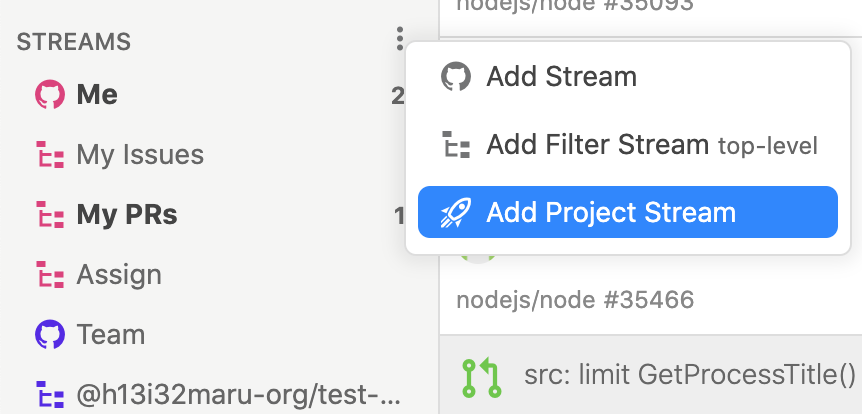

# Project Stream

Project Streamには「プロジェクトの提案」からあなたが関わったGitHubプロジェクトを指定することができます。もしくはGitHub ProjectのURLを手動で指定することもできます。











Project Streamを選択すると、Project Boardが自動的に表示されます。Project Board上のissueはJasper内の未読・既読が反映されて表示されます。

