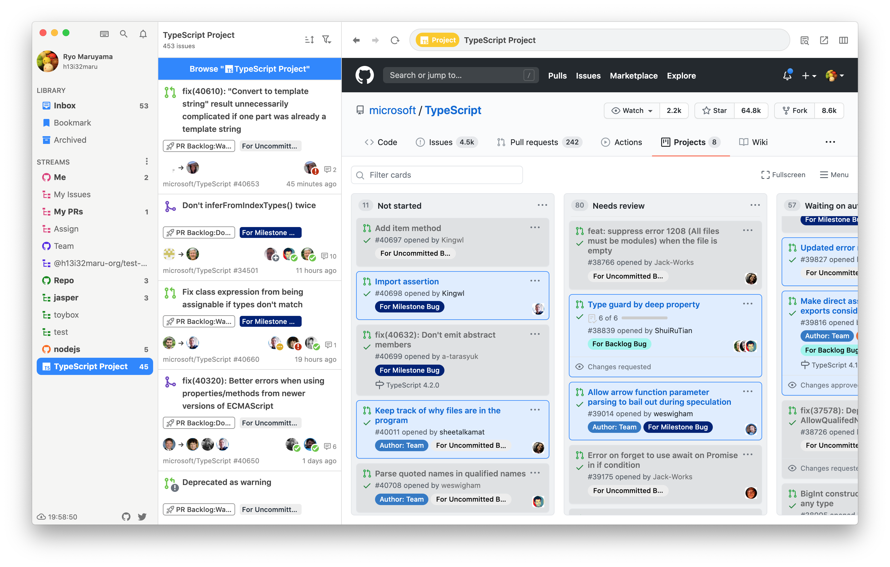

# Project Stream

You can specify the URL of the GitHub Project in the Project Stream.











When you select Project Stream, the Project Board will automatically appear, and the issues on the Project Board will reflect the unread/read issues in Jasper.

