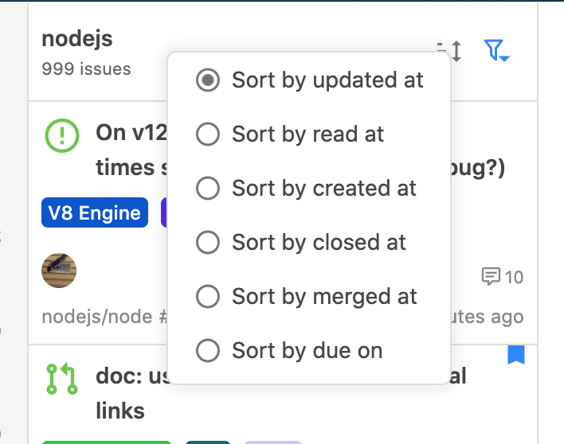
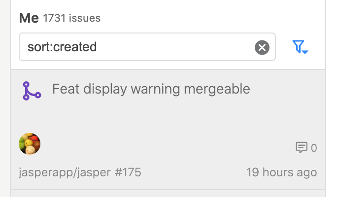

# Sort order

Typically, issues are displayed in order of update, and you can change the order by using the sort order icon at the top of the issue list. You may also change the order by setting the Filter Stream or Filter to `sort:ORDER`.











The following values can be specified for `sort:ORDER`.

| sort | description |
| :--- | :--- |
| `sort:updated` | Updated order |
| `sort:created` | Created order |
| `sort:closed` | Closed order |
| `sort:merged` | Merged order |
| `sort:read` | Read order |
| `sort:archived` | Archived order |
| `sort:bookmark` | Bookmarked order |
| `sort:author` | Author name order |
| `sort:user` | User name/organization name order |
| `sort:repo` | Repository name order |
| `sort:milestone` | Milestone name order |
| `sort:dueon` | Deadline of milestone order |
| `sort:title` | Title order |
| `sort:number` | Number order |
| `sort:type` | Issue type\(Issue or Pull Request\) order |

You can also specify multiple orders and ascending/descending order.

```text
sort:"updated desc, author asc"
```

