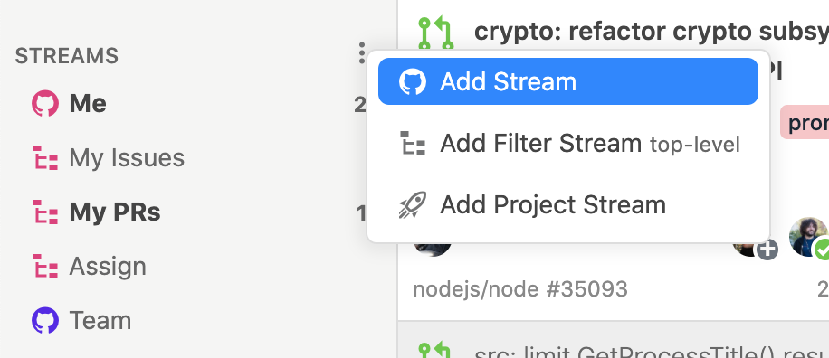
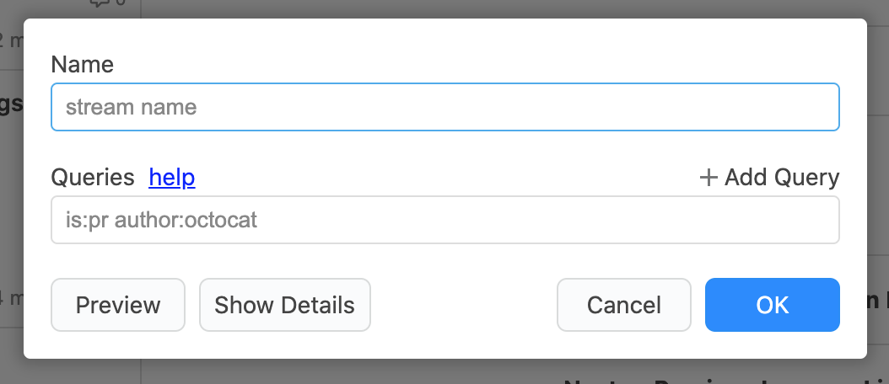

# Stream

Streamは`Add Stream`メニューから追加します。












Streamに使用できるクエリはGitHub Searchのクエリと完全に互換性があります。GitHub Searchの全クエリとシンタックスについては「[Searching issues and pull requests - github.com](https://docs.github.com/en/github/searching-for-information-on-github/searching-issues-and-pull-requests)」と「[Understanding the search syntax - github.com](https://docs.github.com/en/github/searching-for-information-on-github/understanding-the-search-syntax)」を参照してください。


## issueの状態 

<table>
  <thead>
    <tr>
      <th style="text-align:left">&#x30AF;&#x30A8;&#x30EA;</th>
      <th style="text-align:left">&#x8AAC;&#x660E;</th>
    </tr>
  </thead>
  <tbody>
    <tr>
      <td style="text-align:left"><code>is:issue</code>, <code>is:pr</code>
      </td>
      <td style="text-align:left">issue&#x306E;&#x307F;&#x3001;pull request&#x306E;&#x307F;</td>
    </tr>
    <tr>
      <td style="text-align:left">
        
<code>is:open</code>, <code>is:closed</code>
        

        
&#x203B;&#x975E;&#x63A8;&#x5968;

      </td>
      <td style="text-align:left">&#x30AA;&#x30FC;&#x30D7;&#x30F3;&#x3055;&#x308C;&#x3066;&#x3044;&#x308B;issue&#x3001;&#x30AF;&#x30ED;&#x30FC;&#x30BA;&#x3055;&#x308C;&#x3066;&#x3044;&#x308B;issue</td>
    </tr>
    <tr>
      <td style="text-align:left">
        
<code>is:merged</code>, <code>is:unmerged</code>
        

        
&#x203B;&#x975E;&#x63A8;&#x5968;

      </td>
      <td style="text-align:left">&#x30DE;&#x30FC;&#x30B8;&#x3055;&#x308C;&#x3066;&#x3044;&#x308B;issue&#x3001;&#x30DE;&#x30FC;&#x30B8;&#x3055;&#x308C;&#x3066;&#x3044;&#x306A;&#x3044;issue</td>
    </tr>
    <tr>
      <td style="text-align:left">
        
<code>draft:true</code>, <code>draft:false</code>
        

        
&#x203B;&#x975E;&#x63A8;&#x5968;

      </td>
      <td style="text-align:left">&#x30C9;&#x30E9;&#x30D5;&#x30C8;&#x306E;issue&#x3001;&#x30C9;&#x30E9;&#x30D5;&#x30C8;&#x3067;&#x306F;&#x306A;&#x3044;issue</td>
    </tr>
  </tbody>
</table>


オープン状態、マージ状態、ドラフト状態のクエリは非推奨です。これらのクエリを使用する場合はFilter Streamをお使いください。詳しくは[こちら](../usecase/query.md#open-issue)を参照してください。


## ユーザやチーム 

| クエリ | 説明 |
| :--- | :--- |
| `involves:defunkt` | ユーザが関係するissue |
| `author:defunkt` | ユーザが作成したissue |
| `assignee:defunkt` | ユーザがアサインされたissue |
| `mentions:defunkt` | ユーザがメンションされたissue |
| `commenter:defunkt` | ユーザがコメントしたissue |
| `team:github/owners` | チームがメンションされたissue |


同じ種類のクエリを複数指定するとOR条件になります。例えば、`involves:defunkt involves:jlord` は`defunkt`もしくは`jlord`が関係するissueです。



involvesはauthor, assignee, mentions, commenter, review-requestedをまとめて指定したものと同様になります。


## Pull requestレビュー 

<table>
  <thead>
    <tr>
      <th style="text-align:left">&#x30AF;&#x30A8;&#x30EA;</th>
      <th style="text-align:left">&#x8AAC;&#x660E;</th>
    </tr>
  </thead>
  <tbody>
    <tr>
      <td style="text-align:left"><code>review-requested:defunkt</code>
      </td>
      <td style="text-align:left">&#x30E6;&#x30FC;&#x30B6;&#x306B;&#x30EC;&#x30D3;&#x30E5;&#x30FC;&#x30EA;&#x30AF;&#x30A8;&#x30B9;&#x30C8;&#x3055;&#x308C;&#x305F;pull
        request</td>
    </tr>
    <tr>
      <td style="text-align:left"><code>team-review-requested:github/owners</code>
      </td>
      <td style="text-align:left">&#x30C1;&#x30FC;&#x30E0;&#x306B;&#x30EC;&#x30D3;&#x30E5;&#x30FC;&#x30EA;&#x30AF;&#x30A8;&#x30B9;&#x30C8;&#x3055;&#x308C;&#x305F;pull
        request</td>
    </tr>
    <tr>
      <td style="text-align:left"><code>reviewed-by:defunkt</code>
      </td>
      <td style="text-align:left">&#x30E6;&#x30FC;&#x30B6;&#x304C;&#x30EC;&#x30D3;&#x30E5;&#x30FC;&#x3057;&#x305F;pull
        request</td>
    </tr>
    <tr>
      <td style="text-align:left"><code>review:approved</code>, <code>review:changes_requested</code>
      </td>
      <td style="text-align:left">
        
approved&#x3055;&#x308C;&#x305F;pull request,

        
changes requested&#x3055;&#x308C;&#x305F;pull request

      </td>
    </tr>
  </tbody>
</table>


同じ種類のクエリを複数指定するとOR条件になります。例えば、`review-requested:defunkt review-requested:jlord`は`defunkt`もしくは`jlord`がレビューリクエストされたpull requestです。


## リポジトリやOrganization 

| クエリ | 説明 |
| :--- | :--- |
| `repo:nodejs/node` | リポジトリのissue |
| `org:nodejs` | Organizationのissue |
| `user:defunkt` | ユーザ下のissue |


同じ種類のクエリを複数指定するとOR条件になります。例えば、`repo:nodejs/node repo:electron/electron`は`nodejs/node`もしくは`electron/electron`のissueです。


## ラベルやマイルストーンなど 

| クエリ | 説明 |
| :--- | :--- |
| `label:bug` | ラベルがついたissue |
| `milestone:v1.0.0` | マイルストーンがついたissue |
| `project:github/57` | Organizationプロジェクトのissue |
| `project:github/linguist/1` | リポジトリプロジェクトのissue |


同じ種類のクエリを複数指定するとOR条件になります。例えば、`milestone:v1.0.0 milestone:v2.0.0`は`v1.0.0`もしくは`v2.0.0`のissueです。  
ただし、ラベルについてはAND条件となります。



スペースを含むラベルやマイルストーンの場合は`label:"foo bar"`のようにダブルクオーテーションで囲んでください。


## 任意のキーワード 

| クエリ | 説明 |
| :--- | :--- |
| `github octocat` | キーワード\(AND条件\)が含まれるissue |
| `github OR octocat` | キーワード\(OR条件\)が含まれるissue |
| `github NOT octocat` | キーワード\(NOT条件\)が含まれるissue |


スペースを含む場合は`"hello world"`のようにダブルクオーテーションで囲んでください。



AND, OR, NOTについては5つまでしか含まれることはできません。詳しくは「[Limitations on query length - github.com](https://docs.github.com/en/github/searching-for-information-on-github/troubleshooting-search-queries#limitations-on-query-length)」を参照してください。


## 除外・未設定 

| クエリ | 説明 |
| :--- | :--- |
| `-label:bug`,  `-milestone:v0.0.1`,  `-repo:nodejs/node` `-involves:defunk`... | 指定した条件が含まれないissue |
| `no:label`, `no:milestone`,  `no:assignee`, `no:project` | ラベル、マイルストーン、アサイン、 プロジェクトが設定されていないissue |

