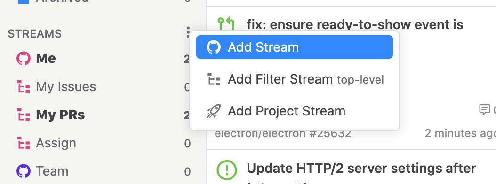

# Stream

Streams can be added from the `Add Stream` menu.












Streamに使用できるクエリはGitHub Searchのクエリと完全に互換性があります。  
See "[Searching issues and pull requests - github.com](https://docs.github.com/en/free-pro-team@latest/github/searching-for-information-on-github/searching-issues-and-pull-requests)"and "[Understanding the search syntax - github.com](https://docs.github.com/en/free-pro-team@latest/github/searching-for-information-on-github/understanding-the-search-syntax)" for all GitHub Search queries and syntax.


## State of issues

<table>
  <thead>
    <tr>
      <th style="text-align:left">Query</th>
      <th style="text-align:left">description</th>
    </tr>
  </thead>
  <tbody>
    <tr>
      <td style="text-align:left"><code>is:issue</code>, <code>is:pr</code>
      </td>
      <td style="text-align:left">Issue only, pull request only</td>
    </tr>
    <tr>
      <td style="text-align:left">
        
<code>is:open</code>, <code>is:closed</code>
        

        
<em>not recommended</em>
        

      </td>
      <td style="text-align:left">Opened issues, closed issues</td>
    </tr>
    <tr>
      <td style="text-align:left">
        
<code>is:merged</code>, <code>is:unmerged</code>
        

        
<em>not recommended</em>
        

      </td>
      <td style="text-align:left">Merged issues, unmerged issues</td>
    </tr>
    <tr>
      <td style="text-align:left">
        
<code>draft:true</code>, <code>draft:false</code>
        

        
<em>not recommended</em>
        

      </td>
      <td style="text-align:left">Draft issues, not draft issues</td>
    </tr>
  </tbody>
</table>


Open, merge and draft state queries are not recommended. If you use these queries, use Filter Stream. See [here](../usecase/query.md#open-issue) for more information.


## Involve users and teams

| Query | description |
| :--- | :--- |
| `involves:defunkt` | User involved issues |
| `author:defunkt` | User created issues |
| `assignee:defunkt` | User assigned issues |
| `mentions:defunkt` | User mentioned issues |
| `commenter:defunkt` | User commented issues |
| `team:github/owners` | Team mentioned issues |


Multiple queries of the same type become OR conditions. For example, `Involves:defunkt involves:jlord` is issues involving `defunkt` or `jlord`.



`involves` as well as `author`, `assignee`, `mentions`, `commenter`, and `review-requested` all together.


## Pull requests review

<table>
  <thead>
    <tr>
      <th style="text-align:left">Query</th>
      <th style="text-align:left">description</th>
    </tr>
  </thead>
  <tbody>
    <tr>
      <td style="text-align:left"><code>review-requested:defunkt</code>
      </td>
      <td style="text-align:left">Pull requests where the user has requested a review</td>
    </tr>
    <tr>
      <td style="text-align:left"><code>team-review-requested:github/owners</code>
      </td>
      <td style="text-align:left">Pull requests for which the team has requested a review</td>
    </tr>
    <tr>
      <td style="text-align:left"><code>reviewed-by:defunkt</code>
      </td>
      <td style="text-align:left">User reviewed pull requests</td>
    </tr>
    <tr>
      <td style="text-align:left"><code>review:approved</code>, <code>review:changes_requested</code>
      </td>
      <td style="text-align:left">
        
Approved pull requests,

        
Changes requested pull requests

      </td>
    </tr>
  </tbody>
</table>


Multiple queries of the same type become OR conditions. For example, `review-requested:defunkt review-requested:jlord` is pull requests where `defunk` or `jlord` is the review request.


## Repository and organization

| Query | description |
| :--- | :--- |
| `repo:nodejs/node` | Repository issues |
| `org:nodejs` | Organization issues |
| `user:defunkt` | User issues |


Multiple queries of the same type will result in OR conditions. For example, `repo:nodejs/node repo:electron/electron` is issues `nodejs/node` or `electron/electron`.


## Labels, milestones, etc.

| Query | description |
| :--- | :--- |
| `label:bug` | Labeled issues |
| `milestone:v1.0.0` | Milestone issues |
| `project:github/57` | Organization project issues |
| `project:github/linguist/1` | Repository project issues |


More than one query of the same type is an OR condition. For example, `milestone:v1.0.0.0 milestone:v2.0.0` is an issue with a `v1.0.0` or `v2.0.0.0` milestone. However, this is an AND condition for labels.



A label or milestone containing spaces should be enclosed in double quotes, such as `label: "hello world"`.


## Any keywords

| Query | description |
| :--- | :--- |
| `github octocat` | Issues containing the keywords \(AND conditions\) |
| `github OR octocat` | Issues containing the keyword \(OR condition\) |
| `github NOT octocat` | Issues containing the keywords \(NOT conditions\) |


To include spaces, use double quotation marks, such as `"hello world"`.



AND, OR, and NOT can only contain up to five query lengths. See "[Limitations on query length - github.com](https://docs.github.com/en/free-pro-team@latest/github/searching-for-information-on-github/troubleshooting-search-queries#limitations-on-query-length)" for more information.


## Exclusion and missing 

<table>
  <thead>
    <tr>
      <th style="text-align:left">Query</th>
      <th style="text-align:left">description</th>
    </tr>
  </thead>
  <tbody>
    <tr>
      <td style="text-align:left">
        
<code>-label:bug</code>
        

        
<code>-milestone:v0.0.1</code> 
           <code>-repo:nodejs/node</code>
        

        
<code>-involves:defunk</code>
        

        
and more

      </td>
      <td style="text-align:left">Issues that do not contain the specified conditions</td>
    </tr>
    <tr>
      <td style="text-align:left">
        
<code>no:label</code>
        

        
<code>no:milestone</code> 
           <code>no:assignee</code>
        

        
<code>no:project</code>
        

      </td>
      <td style="text-align:left">
        
Labels, Milestones, Assignments,

        
and An issue with no project set up

      </td>
    </tr>
  </tbody>
</table>

