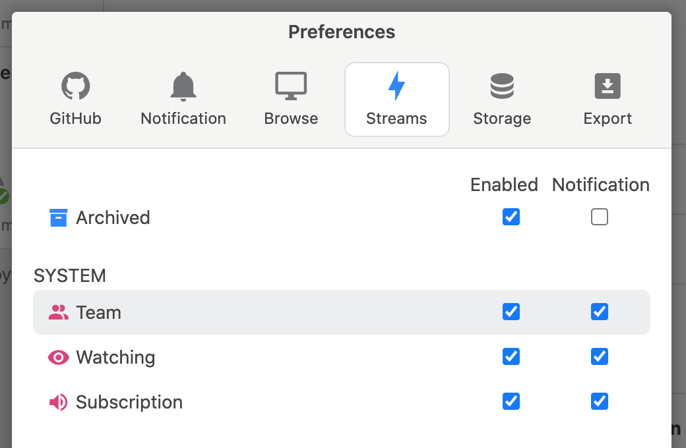

# System Stream

System Streamとは動的にクエリを生成するシステム組み込みのストリームです。System Streamを使用する場合は`メニュー → Preferences → Streams`から有効にしてください。

| System Stream | 内容 |
| :--- | :--- |
| `Team Stream` | 自身がGitHub上で所属するチームがメンションされたissue |
| `Watching Stream` | 自身がGitHub上でwatchしているリポジトリのissue |
| `Subscription Issue` | 個別に指定されたissue |

Team Streamは自身がGitHub上で所属するチームを取得して、そのチームがメンションされたissueを扱うことができます。新しくチームに所属した場合、自動的にチームが追加されます。

Watching Streamは自身がGitHub上でwatchしたリポジトリを取得して、そのリポジトリのissueを扱うことができます。新しくリポジトリをwatchした場合、自動的にリポジトリが追加されます。

Subscription Streamは個別に指定されたissueを扱うことができます。Subscription StreamのメニューからissueのURLを登録してください。

