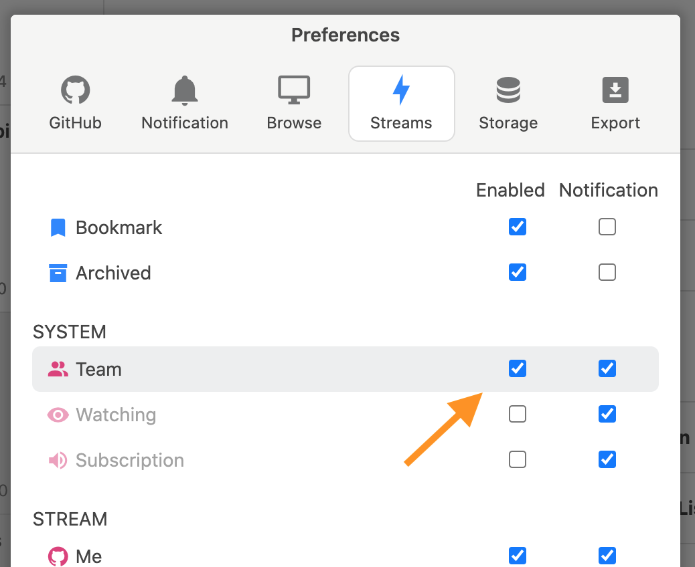
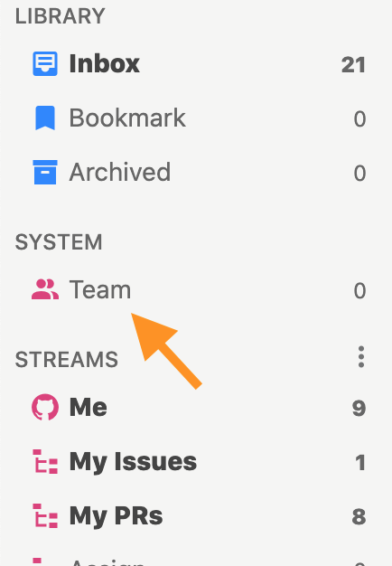
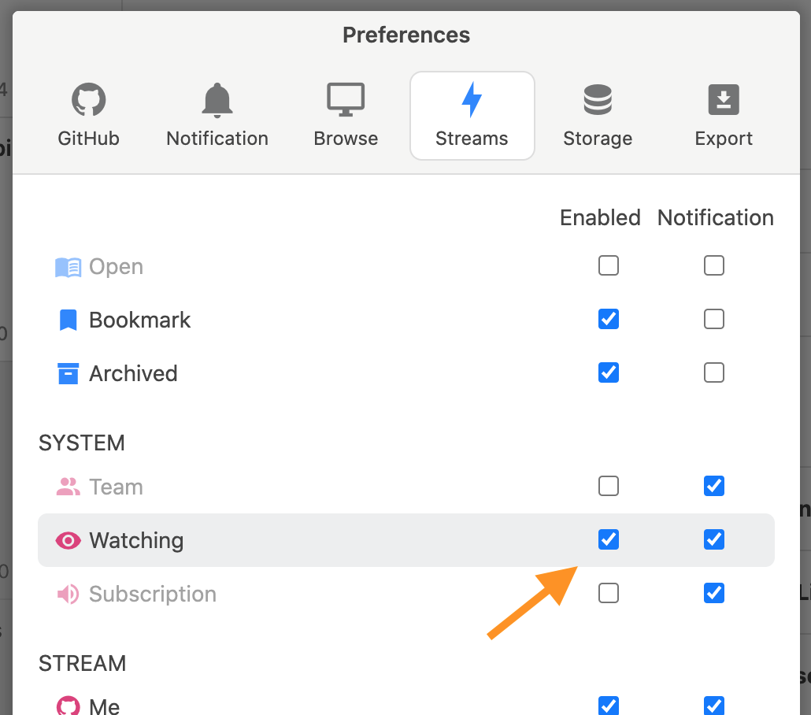
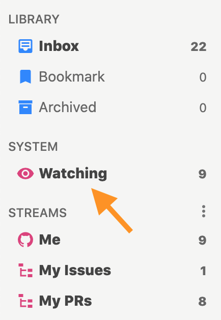
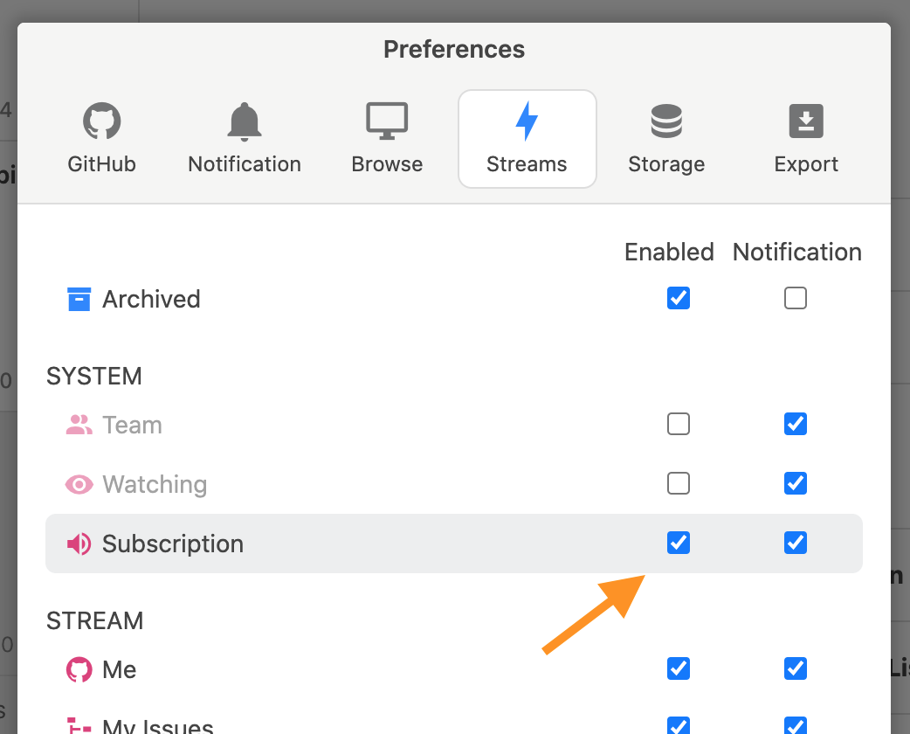
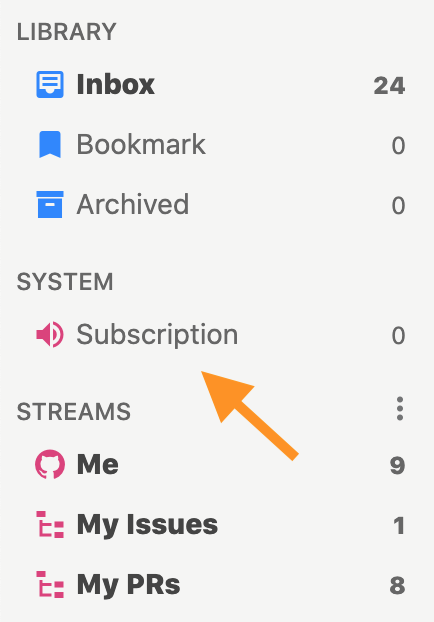
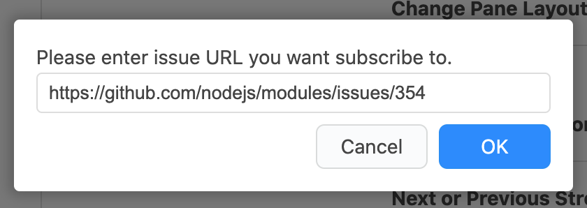
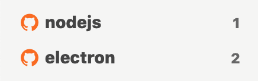
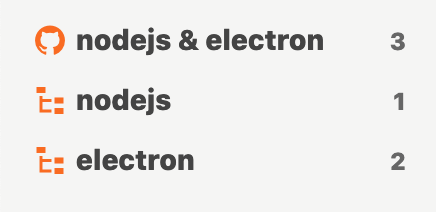

# 高度な設定

## スマートフォンと連携 <a id="mobile"></a>

スマートフォンや通常のブラウザで閲覧したissueを、Jasperでも既読にするためにはGitHub Notification Syncを有効にします。


この設定を有効にすると定期的\(通常は60秒間隔\)に[GitHub Notification](https://github.com/notifications)からJasper側に反映させます。


JasperからGitHub Notificationへの反映は「issueを閲覧して既読にした」場合のみ行われます。次の操作はGitHub Notificationへは反映されません。

* Jasperで未読にしたissue
* Jasperでメニューやキーボードショートカットにより既読にしたissue


## GitHub Projectsと連携 <a id="project"></a>

特定のGithub Projectsに関連するissueを見るにはProject Streamを作成します。












`project:REPOSITORY/PROJECT_BOARD`クエリを使い、通常のStreamを作成しGitHub Projects に関連するissueを見ることはできます。しかしProject Streamを使うことでProject Board\(カンバン\)との連携が可能になるので、Project Streamを使うことをおすすめします。


## GitHub Teamと連携 <a id="team"></a>

自分が所属するGitHub Teamへメンションされたissueを見るにはTeam Streamを使います。Team Streamは設定画面から有効にします。











自分が所属するTeamからクエリが自動的に作成されます。






## GitHub Watchingと連携する <a id="watching"></a>

自分がGitHub上でwatchしたリポジトリのissueを見るにはWatching Streamを使います。Watching Streamは設定画面から有効にします。











自分がwatchするリポジトリからクエリが自動的に作成されます。





## 任意のissueを登録する <a id="subscription"></a>

リポジトリやorganizationではなく、issue単独でStreamにしたい場合はSubscription Streamを使います。Subscription Streamは設定画面から有効にします。











Subscription Streamを右クリックして、メニューからissueのURLを登録します。





## 更新間隔を最適化する <a id="polling"></a>

Jasperは通常10秒ごとにissueを検索して更新を取得しています。この更新間隔はStreamごとではなく、Jasper全体の更新間隔です。つまり、Streamをたくさん作れば作るほど、Stream1個あたりの更新は遅くなります。例えばStreamを3つ作っていた場合、1つのStreamが更新されるのは30秒ごとになります。


このような動作になっているのは、Streamが増えてもGitHub側に負荷をかけないようにするためです。


このため、たくさんStreamを作ると更新が遅くなってしまいます。そこで、通常のStreamを少なくしてFilter Streamを積極的に使うことで、更新が遅くならないようにします。


Filter StreamはGitHubの検索を行わず、ローカルのissueをフィルターするため更新間隔に影響を与えません。Filter Streamについての詳細は「[Filter Stream](../reference/filter-stream.md)」を参照してください。


例えば次のような2つのStreamを作るのではなく、1つのStreamと2つのFilter Streamを作ります。こうすることで前者では1つのStreamあたり20秒間隔の更新だったものが、後者では1つのStreamあたり10秒間隔になります。



```text
org:nodejs
```

```text
org:electron
```





```text
org:nodejs org:electron
```

```text
org:nodejs
```

```text
org:electron
```





JasperではこのようにFilter Streamを積極的に利用することを推奨しています。

