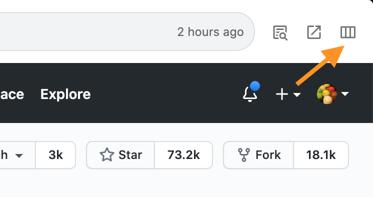

# Appearance and notifications

## Colors and notification settings 

Streams can be configured with colors and icons in the detail settings. This allows for grouping and allows you to make important Streams stand out from the crowd.

Notifications can also be turned on or off per Stream. If you don't want to be notified, you can turn off notifications for the streams you don't want to be notified about, so you don't miss any important notifications. Notifications can also be configured in batches from the Preferences screen.












Icons are available for all types of icons registered in [Material Design Icons](https://materialdesignicons.com/).


## Hide the Stream

You can also hide unwanted Streams. For example, if you don't use `Inbox` or `Archive`, you can hide them to make Jasper easier to see.

## General notification settings

You can also turn off notifications for the entire issue if you want to focus on viewing the issue. You can turn notifications on/off by clicking the 🔔 icon in the top left corner. Or you can press `⌘ + I`.

## Change the layout

You can increase the display area of an issue if you have a small screen, or if you are doing a pull request code review. You can increase the display area by toggling the layout icon in the top right corner, or you can toggle it by pressing ⌘ + 1, ⌘ + 2, or ⌘ + 3. You can also switch between them by pressing `⌘ + 1`, `⌘ + 2`, or `⌘ + 3`.



















