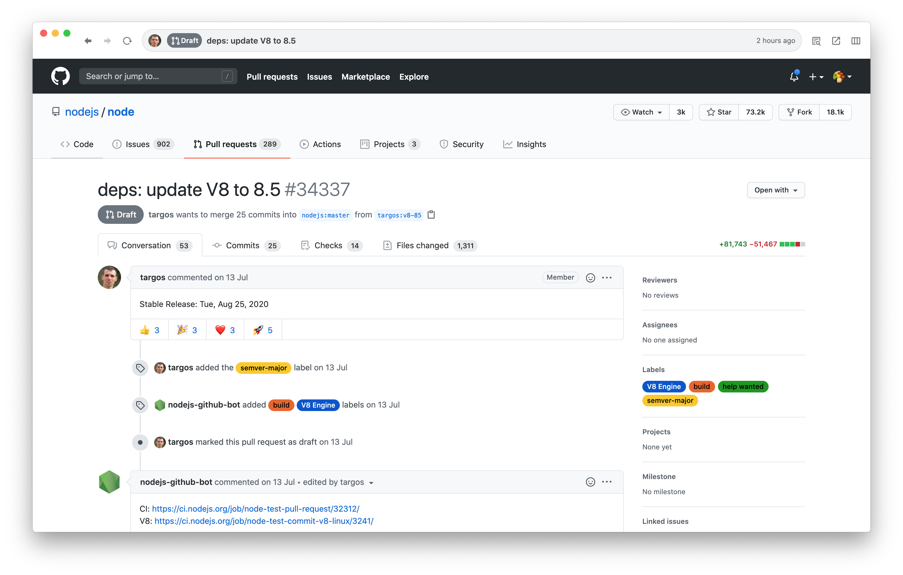

# 見た目と通知

## Streamの色や通知を設定する 

Streamは詳細設定から色とアイコンを設定できます。これによりグルーピングをしたり、重要なStreamを目立つようにできます。

また、通知はStreamごとにオン/オフを設定することができます。通知されるほどではないStreamについては通知をオフにすることで重要な通知を見逃さなくなります。通知はPreferences画面からまとめて設定することもできます。












アイコンは[Material Design Icons](https://materialdesignicons.com/)に登録されている全種類のアイコンを使用できます。


## 全体の通知設定 

集中してissueやpull requestを閲覧したい場合、全体の通知をオフにすることもできます。通知をオン/オフの切り替えは左上の🔔アイコンからできます。もしくは`⌘ + I`を押すことでもできます。

## 表示レイアウトを変える 

画面が小さい場合やpull requestのコードレビューをする場合、issueの表示領域を大きくすることができます。表示領域を大きくするには右上のレイアウトアイコンから切り替えることができます。もしくは`⌘ + 1`, `⌘ + 2`, `⌘ + 3`を押すことでも切り替えることができます。



















## Streamを非表示にする 

不要なStreamを非表示にすることができます。例えば`Inbox`や`Archive`を使わない場合は、非表示にすることでJasperを見やすくすることができます。

