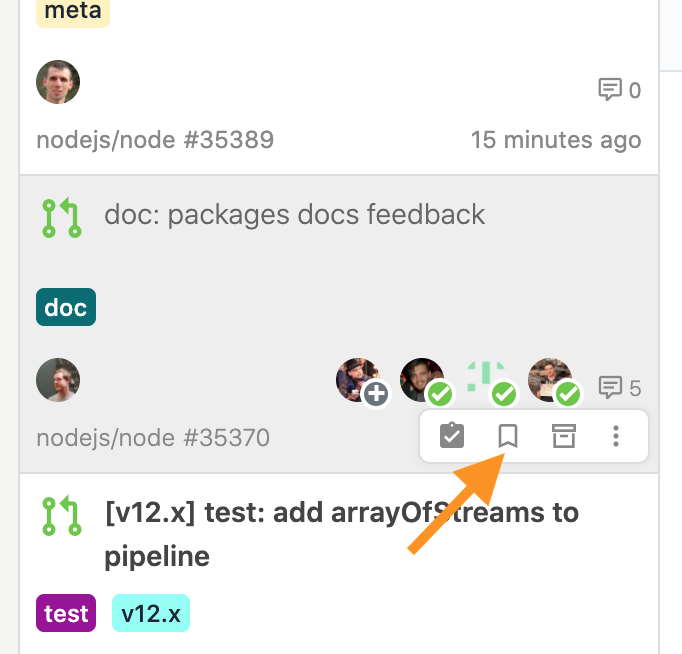
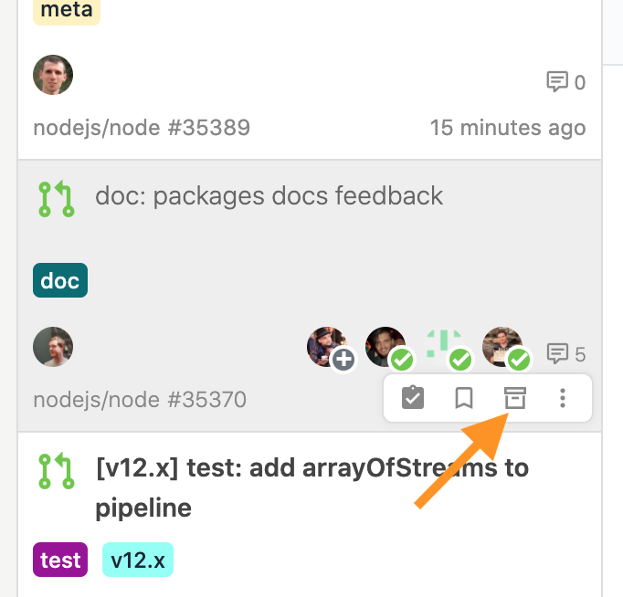

# Browse issues

## Unread issues 

To quickly display just the unread issues, use the issue's filter function - select `Filter by unread` from the filters at the top of the issue list. Alternatively, you can also display just the unread issues by pressing `U` on your keyboard.

## Read it later.

If you want to read it later, there are two ways to do it in Jasper.

The first is to return an issue to unread by selecting `Mark as Unread` from the issue's floating menu. Alternatively, you can press  `I`  on the keyboard on a selected issue to mark it back as unread.

The second way to bookmark an issue is to add it to your bookmarks. Select `Add to Bookmark` from the issue's floating menu. Alternatively, you may bookmark a selected issue by pressing  `B`  on the keyboard.











## Exclude unwanted issues 

You can use the archive feature to exclude issues that you do not need to view in the future. To archive, select `Move to Archive` from the floating menu. Alternatively, you may archive an issue in the selected state by pressing the `E` key on your keyboard.

## Check unread comments 

When viewing an issue in Jasper's built-in browser, Jasper will highlight the comments that have been added or updated since the last time you viewed the issue. You will also see a mini-map of the comments that have been added/updated on the left side of the issue. You can use this comment highlighting and minimap to quickly see which comments have not been read.











Also, any updates to the body of the issue will be displayed as a differential.











