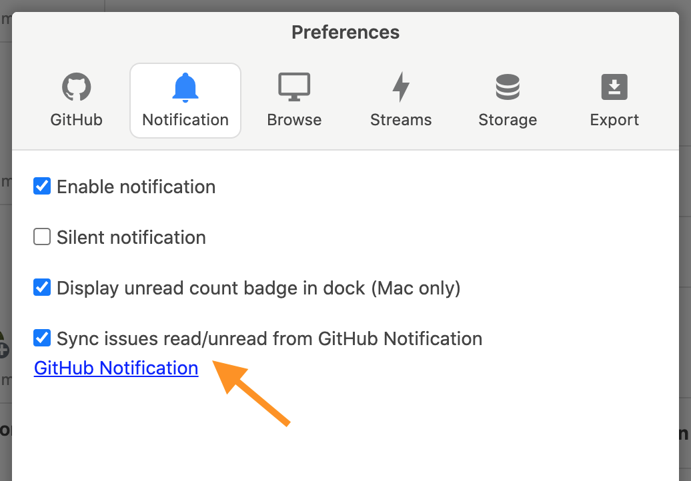
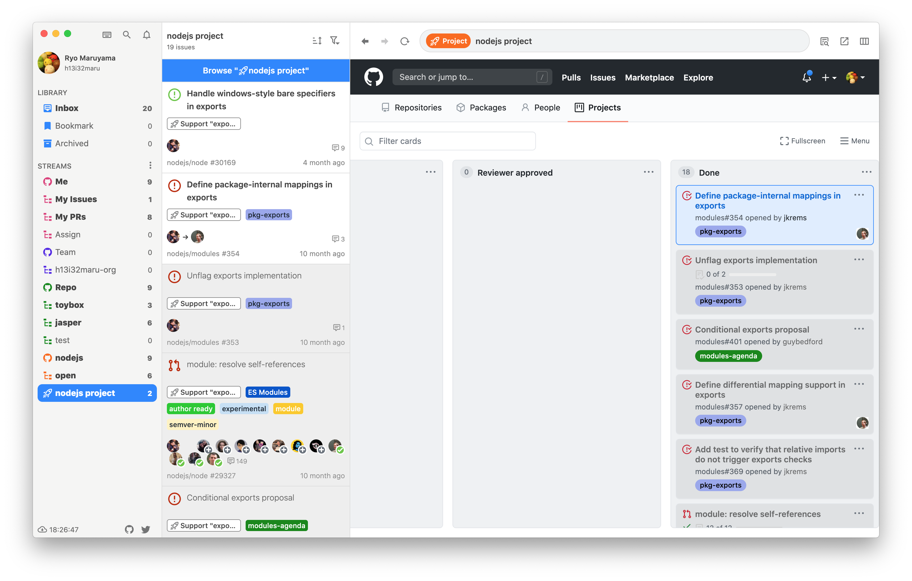
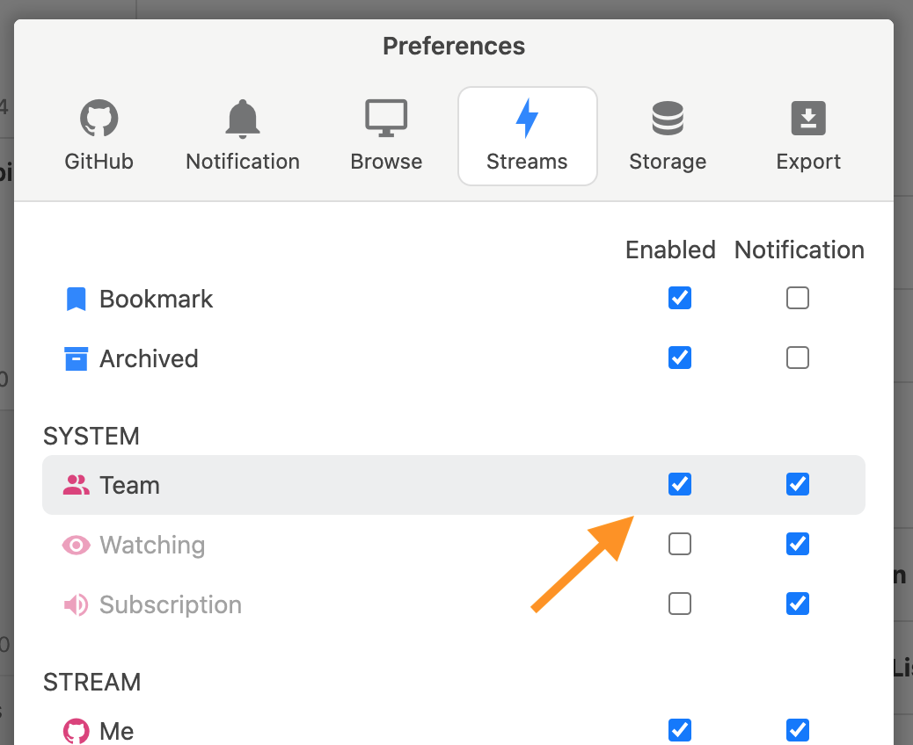
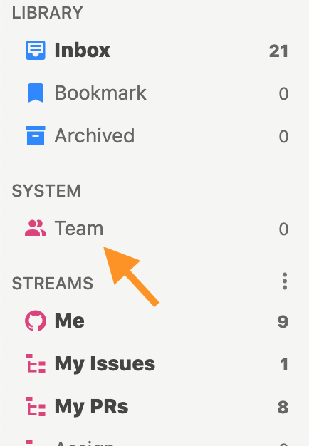
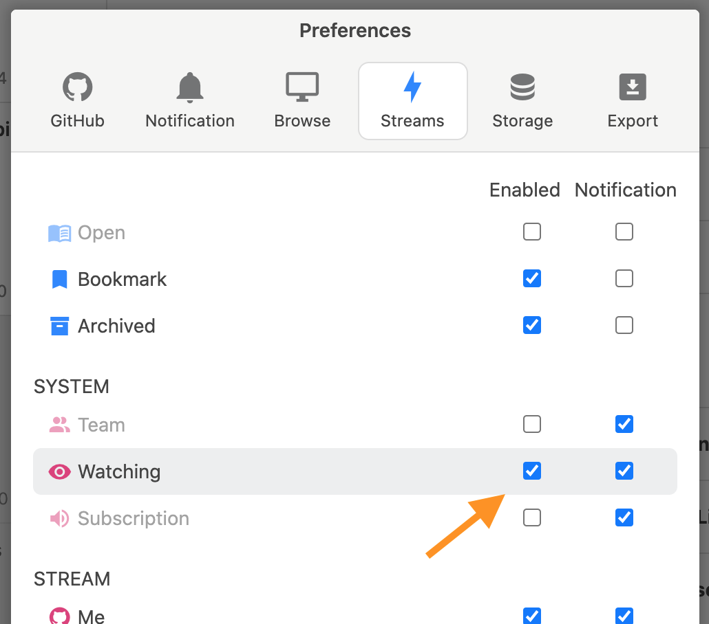
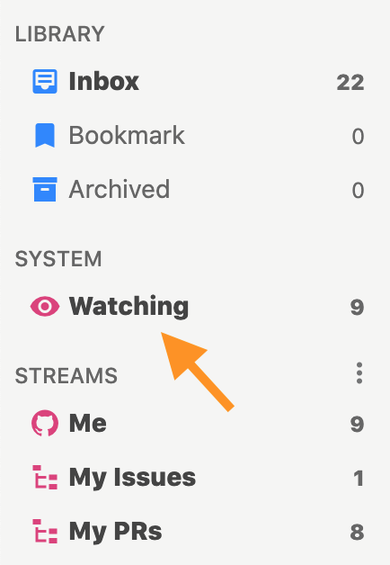
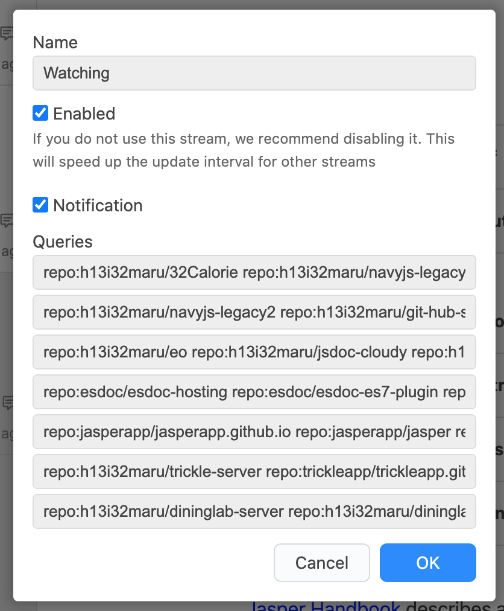
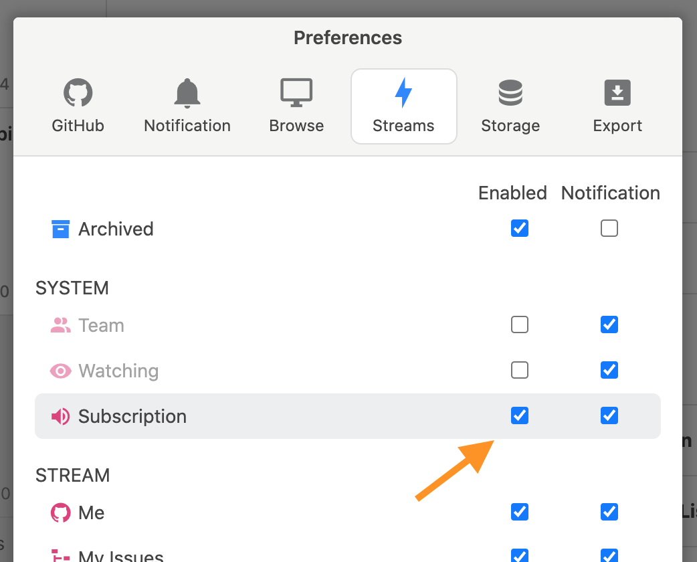
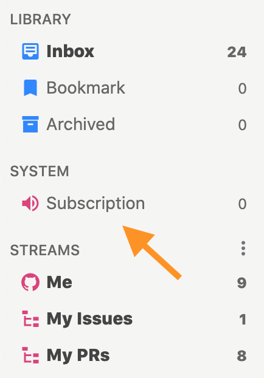
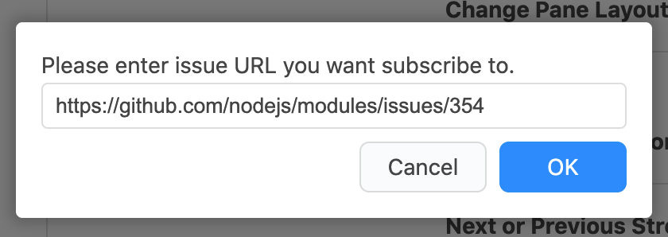

# GitHubと連携

## スマートフォンと連携 

スマートフォンや通常のブラウザで閲覧したissueを、Jasperでも既読にするためにはGitHub Notification Syncを有効にします。

この設定を有効にすると定期的\(通常は60秒間隔\)に[GitHub Notification](https://github.com/notifications)からJasper側に反映させます。


JasperからGitHub Notificationへの反映は「issueを閲覧して既読にした」場合のみ行われます。次の操作はGitHub Notificationへは反映されません。

* Jasperで未読にしたissue
* Jasperでメニューやキーボードショートカットにより既読にしたissue


## GitHub Projectsと連携 

特定のGithub Projectsに関連するissueを見るにはProject Streamを作成します。












`project:REPOSITORY/PROJECT_BOARD`クエリを使い、通常のStreamを作成しGitHub Projects に関連するissueを見ることはできます。しかしProject Streamを使うことでProject Board\(カンバン\)との連携が可能になるので、Project Streamを使うことをおすすめします。


## GitHub Teamと連携 

自分が所属するGitHub Teamへメンションされたissueを見るにはTeam Streamを使います。Team Streamは設定画面から有効にします。











自分が所属するTeamからクエリが自動的に作成されます。




## GitHub Watchingと連携する 

自分がGitHub上でwatchしたリポジトリのissueを見るにはWatching Streamを使います。Watching Streamは設定画面から有効にします。











自分がwatchするリポジトリからクエリが自動的に作成されます。




## 任意のissueを登録する 

リポジトリやorganizationではなく、issue単独でStreamにしたい場合はSubscription Streamを使います。Subscription Streamは設定画面から有効にします。











Subscription Streamを右クリックして、メニューからissueのURLを登録します。




