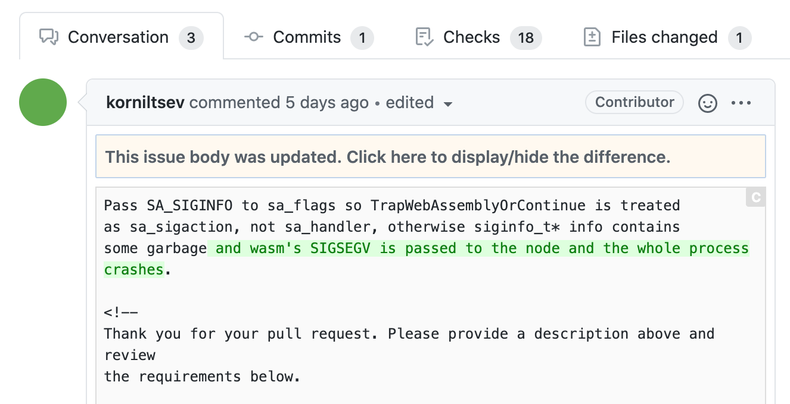

# Browse Issues

## Unread issues

To quickly display just the unread issues, use the issue's filter function - select `Filter by unread` from the filters at the top of the issue list. Alternatively, you can also display just the unread issues by pressing `U` on your keyboard.

## Read it later.

If you want to read it later, Jasper offers two ways to return an issue to unread: by selecting `Mark as Unread` from the issue's floating menu. Alternatively, you may choose to mark an issue as unread by pressing `I` on the keyboard while it is selected.

The second way to bookmark an issue is to add it to your bookmarks. Select `Add to Bookmark` from the issue's floating menu. Alternatively, you may bookmark a selected issue by pressing  `B`  on the keyboard.

## Exclude unwanted issues

You can use the archive feature to exclude issues that you do not need to view in the future. To archive, select `Move to Archive` from the floating menu. Alternatively, you may archive an issue in the selected state by pressing the `E` key on your keyboard.

## Quickly search for issues

To search through Jasper's holdings of issues, we use the `Jump Navigation` feature, starting with the 🔍 icon in the top left corner. You can also start by pressing `⌘ + E (Mac)`, `Ctrl + E (Window/Linux)`.


You can use the same filters as Filter Stream to search in Jump Navigation. See "[Filter Stream](../reference/filter-stream.md)" in the reference section for more information.


## Focused issue viewing

If you want to focus on viewing an issue, such as reviewing a difficult issue or pull request, you may want to increase the display area of the issue. You can increase the display area of an issue by toggling the layout icon in the top right corner. Alternatively, you can also toggle between them by pressing `⌘ + 1`, `⌘ + 2`, or `⌘ + 3`.



















You can also quickly turn off notifications while browsing an issue so that you are not bothered by them. You can turn notifications on or off by clicking the 🔔 icon in the top left corner. Or you can also press `⌘+I`.

## Check for unread comments.

When viewing an issue in Jasper's built-in browser, Jasper will highlight the comments that have been added or updated since the last time you viewed the issue. You will also see a mini-map of the comments that have been added/updated on the left side of the issue. You can use this comment highlighting and minimap to quickly see which comments have not been read.











Also, any updates to the body of the issue will be displayed as a differential.











