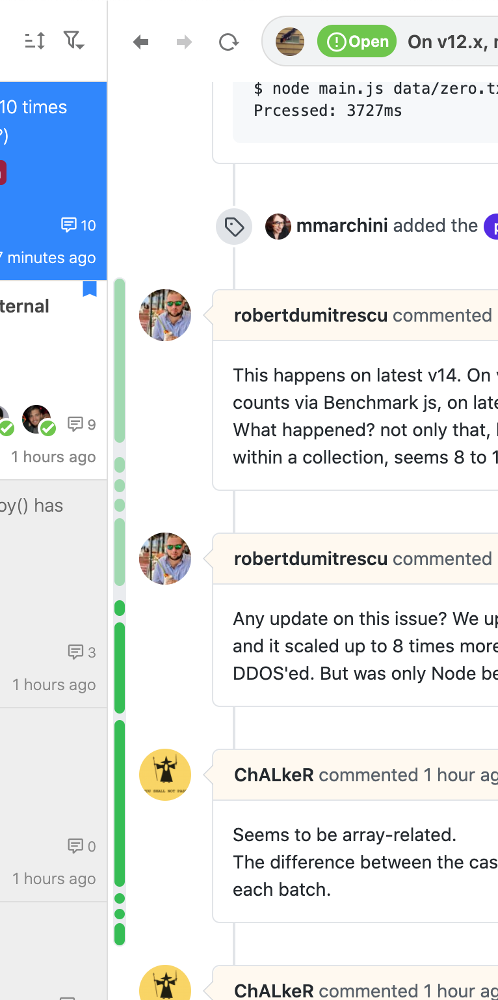

# issueの閲覧

## 未読issueを表示 

未読issueだけを素早く表示するにはissueのフィルター機能を使います。issue一覧の上部にあるフィルターから`Filter by unread`を選択してください。もしくはキーボードの `U` を押すことで未読issueだけを表示することもできます。

## あとで読む 

あとで読む場合、Jasperでは2つの方法があります。1つはissueを未読に戻す方法です。issueのフローティングメニューから`Mark as Unread`を選択します。もしくは選択状態のissueに対してキーボードの `I` を押して未読に戻すこともできます。

2つ目の方法はブックマークに登録する方法です。issueのフローティングメニューから`Add to Bookmark`を選択します。もしくは選択状態のissueに対してキーボードの `B` を押してブックマークに登録することもできます。

## 不要なissueを除外 

今後閲覧する必要がないissueを除外する場合、アーカイブ機能を使用できます。アーカイブするにはフローティングメニューから`Move to Archive`を選択します。もしくは選択状態のissueに対してキーボードの `E` を押してアーカイブすることもできます。

## 素早くissueを検索 

Jasperが保持しているissueの中から検索を行うには`Jump Navigation`機能を使います。Jump Navigationは左上の🔍アイコンから開始します。もしくは`⌘ + E (Mac)`, `Ctrl + E (Window/Linux)`を押すことでも開始できます。


Jump Navigationでの検索にはFilter Streamと同じフィルターが使用できます。詳しくはリファレンスの「[Filter Stream](../reference/filter-stream.md)」を参照してください。


## 集中してissueを閲覧 

難しいissueやpull requestのレビューなど集中してissueを閲覧したい場合、issueの表示領域を大きくすることができます。issueの表示領域を大きくするには右上のレイアウトアイコンから切り替えることができます。もしくは`⌘ + 1`, `⌘ + 2`, `⌘ + 3`を押すことでも切り替えることができます。



















またissue閲覧中に通知が気にならないように、素早く通知をオフにすることもできます。通知をオン/オフの切り替えは左上の🔔アイコンからできます。もしくは`⌘ + I`を押すことでもできます。

## 未読コメントを確認 

Jasperの内部ブラウザでissueを閲覧すると、前回閲覧時から追加・更新されたコメントがハイライトされます。またissueの左側に追加・更新されたコメントのミニマップが表示されます。このコメントのハイライトとミニマップを使って未読のコメントを素早く確認できます。











また、issueの本文に関しては更新があった場合は差分が表示されます。











