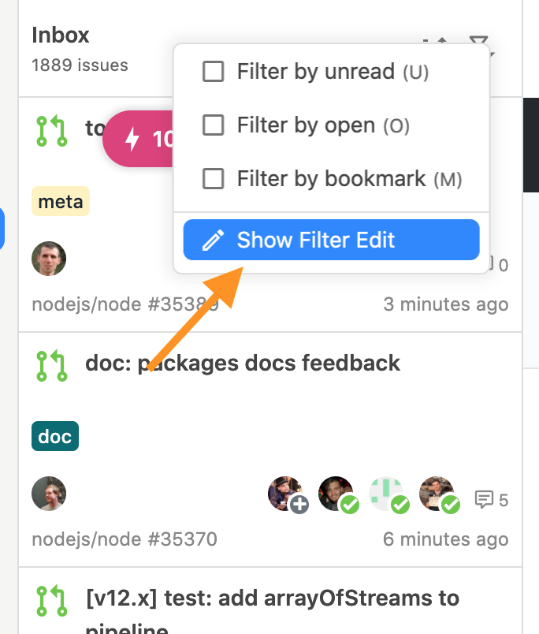

# issueの検索

## Streamから検索

任意のStreamからissueを検索するには`Filter`機能を使います。Filterを使うにはissueリストの上部にあるフィルターアイコンをクリックしてください。


Filterでの検索にはFilter Streamと同じフィルターが使用できます。詳しくはリファレンスの「[Filter Stream](../reference/filter-stream.md)」を参照してください。


## 全体から検索

Jasperが保持している全issueの中から検索を行うには`Jump Navigation`機能を使います。Jump Navigationは左上の🔍アイコンから開始します。もしくは`⌘ + E (Mac)`, `Ctrl + E (Window/Linux)`を押すことでも開始できます。


Jump Navigationでの検索にはFilter Streamと同じフィルターが使用できます。詳しくはリファレンスの「[Filter Stream](../reference/filter-stream.md)」を参照してください。


