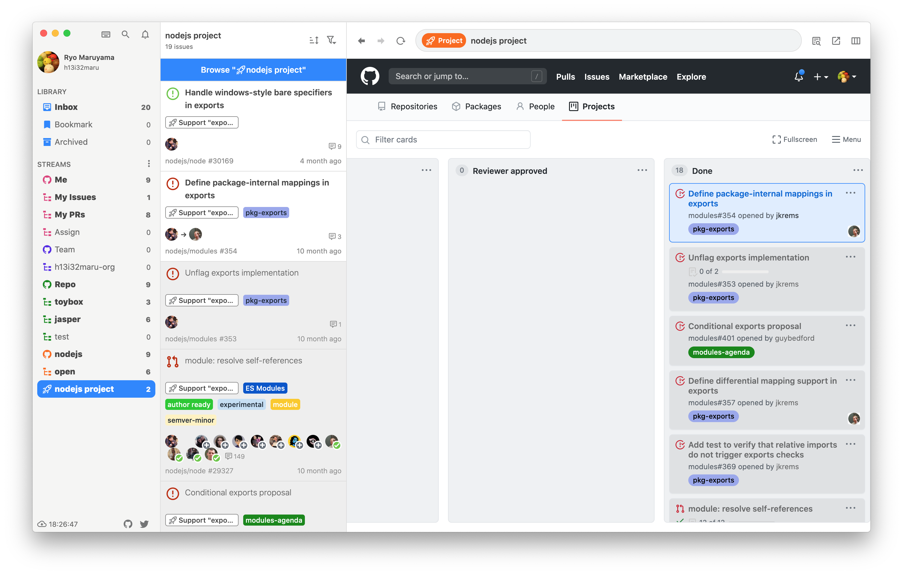
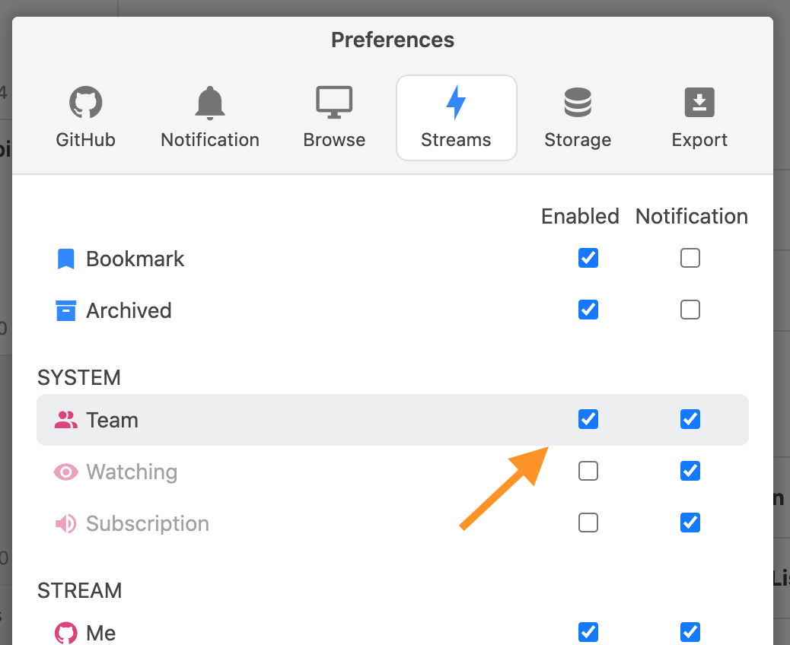
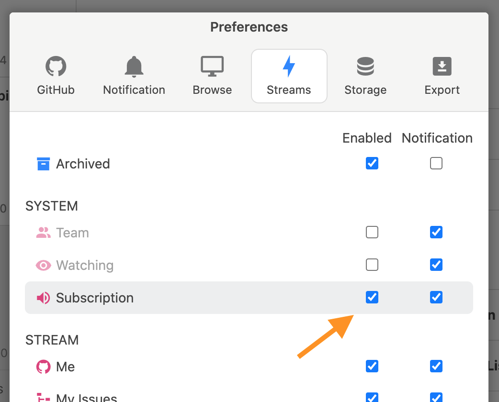
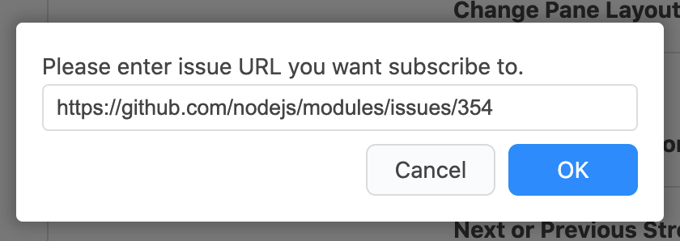

# Advanced Stream

## Smartphone integration <a id="mobile"></a>

You must enable GitHub Notification Sync in order for Jasper to read issues viewed on a smartphone or normal browser.


By enabling this setting, [GitHub Notifications](https://github.com/notifications) will periodically \(usually at 60-second intervals\) reflect this to Jasper.


Jasper will only reflect the issue in GitHub Notifications if you have "Viewed and marked the issue as read". The following operations will not be reflected in GitHub Notifications

* Unread issues in Jasper
* Issues read using a menu or keyboard shortcut in Jasper


## Integration with GitHub Projects <a id="project"></a>

To view issues related to a specific Github Project, create a Project Stream.












With the `project:REPOSITORY/PROJECT_BOARD` query, you can still create a regular Stream to view issues related to GitHub Projects. However, we recommend using Project Stream as it allows you to work with the Project Board \(Kanban\).


## Integration with GitHub Team

Use the Team Stream to view issues that have been mentioned to your GitHub Team.











Queries are automatically created from the Team you belong to.





## Integrating with GitHub Watching

You can use the Watching Stream to view issues in repositories that you have watched on GitHub.











Queries are automatically created from the repositories you watch.





## Register any issues

If you want the issue to be a Stream on its own, rather than a repository or organization, use the Subscription Stream, which you enable from the configuration screen.











Right-click on the Subscription Stream and register the URL of the issue in the menu.





## Optimizing the update interval

Jasper typically looks for an issue every 10 seconds to get an update. This update interval is not per Stream, but rather for the entire Jasper. This means that the more Streams you create, the slower the update per Stream will be. For example, if you are creating three Streams, a Stream will only be updated every 30 seconds.


The reason it works this way is so that more Streams don't overload GitHub.


This is why creating a lot of Streams can slow down updates. So we use fewer regular Streams and more Filter Streams, so that updates are not slowed down.


Filter Stream does not search GitHub and filters local issues, so it does not affect the update interval. For more information on Filter Stream, see "[Filter Stream / Filter](../reference/filter-stream.md)".


For example, instead of creating two Streams, create a Stream and two Filter Streams, like this This will allow you to update at 10 second intervals per stream, instead of 20 seconds per stream in the former.



```text
org:nodejs
```

```text
org:electron
```





```text
org:nodejs org:electron
```

```text
org:nodejs
```

```text
org:electron
```





Jasper recommends using Filter Stream actively in this way.

