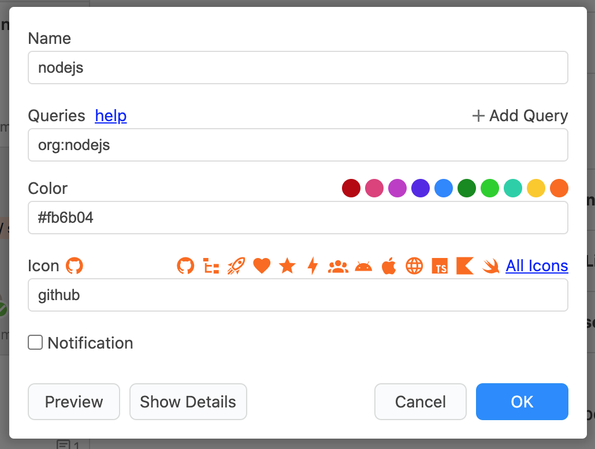

# Streamの見た目と通知設定

## Streamの色や通知を設定する 

Streamは詳細設定から色とアイコンを設定できます。これによりグルーピングをしたり、重要なStreamを目立つようにできます。

また、通知はStreamごとにオン/オフを設定することができます。通知されるほどではないStreamについては通知をオフにすることで重要な通知を見逃さなくなります。


アイコンは[Material Design Icons](https://materialdesignicons.com/)に登録されている全種類のアイコンを使用できます。


## Streamをまとめて設定する 

Streamの通知はJasper全体の設定画面からもまとめて変更できます。

また、不要なStreamを非表示にすることができます。例えば`Inbox`や`Archive`を使わない場合は、非表示にすることでJasperを見やすくすることができます。

