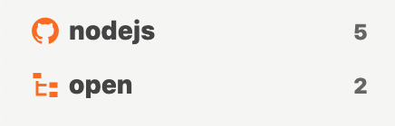

# Streamのクエリ

## オープン状態のissue <a id="open-issue"></a>

オープン\(クローズやマージされていない\)状態のissueを見るStreamを作るには`is:open`を使います。たとえば`nodejs/node`リポジトリのオープンなissueを見るには次のクエリでStreamを作成します。

```text
repo:nodejs/node is:open is:issue
```

しかし、Jasperでは`is:open`を使ったStreamを作ることは非推奨です。なぜなら、オープン状態のissueがクローズされたときにJasperではクローズの検知ができないためです。


これはJasperがGitHub Search APIをポーリングしていることによる制約です


そのため`is:open`を使う場合は通常のStreamではなく、Filter Streamを使うようにしてください。Filter Streamは通常のStreamに対してJasper独自のフィルターをかけることができます。先程の例は次のようになります。

Stream

```text
repo:nodejs/node is:issue
```

Filter Stream

```text
is:open
```




クローズ状態、マージ状態、ドラフト状態についても同様の制限があります。


## Teamメンションされたissue <a id="team-issue"></a>

Teamメンションされたissueを見るには`team:ORGNAME/TEAMNAME`を使います。例えば`@jekyll/owners`がメンションされたissueを見るには次のようなクエリでStreamを作成します。

```text
team:@jekyll/owners
```

GitHub Docs: [Search by team mention](https://docs.github.com/en/github/searching-for-information-on-github/searching-issues-and-pull-requests#search-by-team-mention)

## ユーザが関係するissue <a id="involves-issue"></a>

特定のユーザが関係するissueを見るには`involves:USERNAME`を使います。例えば`defunkt`もしくは`jlord`が関係するissueを見るには次のようなクエリでStreamを作成します。

```text
involves:defunkt involves:jlord
```


`involves:USERNAME`はauthor, assign, mention, comment, review-requestedをまとめて指定することができる便利なクエリです。


GitHub Docs: [Search by a user that's involved in an issue or pull request](https://docs.github.com/en/github/searching-for-information-on-github/searching-issues-and-pull-requests#search-by-a-user-thats-involved-in-an-issue-or-pull-request)

## リポジトリやOrganizationのissue <a id="repo-issue"></a>

特定のリポジトリのissueを見るには`repo:USERNAME/REPOSITORY`を使います。例えば`nodejs/node`もしくは`electron/electron`リポジトリのissueを見るには次のようなクエリでStreamを作成します。

```text
repo:nodejs/node repo:electron/electron
```

特定のOrganizationのissueを見るには`org:ORGNAME`を使います。例えば`nodejs`や`electron` Organizationのissueを見るには次のようなクエリでStreamを作成します。

```text
org:nodejs org:electron
```

GitHub Docs: [Search within a user's or organization's repositories](https://docs.github.com/en/github/searching-for-information-on-github/searching-issues-and-pull-requests#search-within-a-users-or-organizations-repositories)

## マイルストーンやラベルがついたissue <a id="label-issue"></a>

特定のマイルストーンが付いたissueを見るには`milestone:MILESTONE_NAME`を使います。例えば`nodejs/node`リポジトリで`13.0.0`もしくは`14.0.0`のマイルストーンがついたissueを見るには次のようなクエリでStreamを作成します。

```text
repo:nodejs/node milestone:13.0.0 milestone14.0.0
```

特定のラベルが付いたissueを見るには`label:LABEL_NAME`を使います。例えば`nodejs/node`リポジトリで`build`**と**`zlib`のラベルが付いたissueを見るには次のようなクエリでStreamを作成します。

```text
repo:nodejs/node label:build label:zlib
```


複数のラベルを指定するとand条件となります。



スペースを含むマイルストーンやラベルの場合は`milestone:"foo bar"`のように指定してください。


GitHub Docs: [Search by milestone](https://docs.github.com/en/github/searching-for-information-on-github/searching-issues-and-pull-requests#search-by-milestone), [Search by label](https://docs.github.com/en/github/searching-for-information-on-github/searching-issues-and-pull-requests#search-by-label) 

## キーワードが含まれるissue <a id="keyword-issue"></a>

特定のキーワードが含まれるissueを見るにはKEYWORDを使います。例えばoctocatとgithubが含まれるissueを見るには次のようなクリエでStreamを作成します。



```text
octocat github
```



```
octocat OR github
```



```
octocat NOT github
```




日本後などのマルチバイト文字やスペースを含むキーワードは`"foo bar"`のように指定してください。


GitHub Docs: [Limitations on query length](https://docs.github.com/en/github/searching-for-information-on-github/troubleshooting-search-queries#limitations-on-query-length),  [Exclude certain results](https://docs.github.com/en/github/searching-for-information-on-github/understanding-the-search-syntax#exclude-certain-results)

## 含まない指定 <a id="exclude-issue"></a>

特定のリポジトリやラベルを含まないように指定するには-QUALIFIERを使います。例えばnodejs organizatonでnodejs/nodeリポジトリとbugラベルを含まいないissueを見るには次のようなクエリでStreamを作成します。

```text
org:nodejs -repo:nodejs/node -label:bug
```

GitHub Docs: [Exclude certain results](https://docs.github.com/en/github/searching-for-information-on-github/understanding-the-search-syntax#exclude-certain-results)

