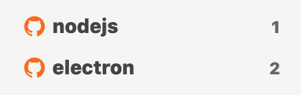
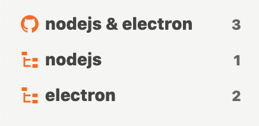

# Streamの更新

## 更新の仕組み <a id="polling"></a>

## 更新間隔を最適化する <a id="polling"></a>

Jasperは通常10秒ごとにissueを検索して更新を取得しています。この更新間隔はStreamごとではなく、Jasper全体の更新間隔です。つまり、Streamをたくさん作れば作るほど、Stream1個あたりの更新は遅くなります。例えばStreamを3つ作っていた場合、1つのStreamが更新されるのは30秒ごとになります。


このような動作になっているのは、Streamが増えてもGitHub側に負荷をかけないようにするためです。


このため、たくさんStreamを作ると更新が遅くなってしまいます。そこで、通常のStreamを少なくしてFilter Streamを積極的に使うことで、更新が遅くならないようにします。


Filter StreamはGitHubの検索を行わず、ローカルのissueをフィルターするため更新間隔に影響を与えません。Filter Streamについての詳細は「[Filter Stream](../reference/filter-stream.md)」を参照してください。


例えば次のような2つのStreamを作るのではなく、1つのStreamと2つのFilter Streamを作ります。こうすることで前者では1つのStreamあたり20秒間隔の更新だったものが、後者では1つのStreamあたり10秒間隔になります。



```text
org:nodejs
```

```text
org:electron
```





```text
org:nodejs org:electron
```

```text
org:nodejs
```

```text
org:electron
```





JasperではこのようにFilter Streamを積極的に利用することを推奨しています。

